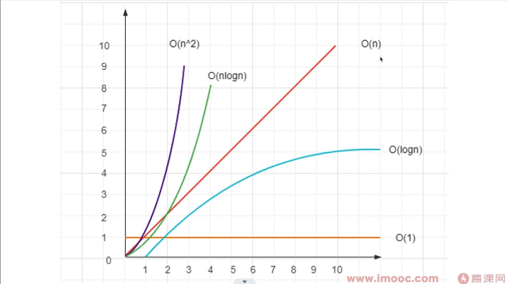

# 总结
##
- 没有复杂度的概念和敏感度，写程序是十分危险的
- 例如，代码功能测试正常，但数量大了，程序就会崩溃
- 对于前端开发，时间复杂度比空间复杂度重要，重时间轻空间

## 注意
再次回顾下这张复杂度的图

- 如果说达到了 O(n^2) 的级别，那么这个算法基本是不可用的！！
- 实际情况下，一个算法应该要保证至少是 O(n) 的复杂度，比较好的情况是能达到 O(logn)
- 一般 O(1) 是不太现实的

## 一个熟悉的例子
- 在 Vue 中，使用了树的 diff 算法。
- 但如果是默认的 diff 算法，它的时间复杂度是 O(n^3) 的，这是不可接受的。
- 但 Vue 在这个基础上做了优化，将时间复杂度降到了 O(n)。
