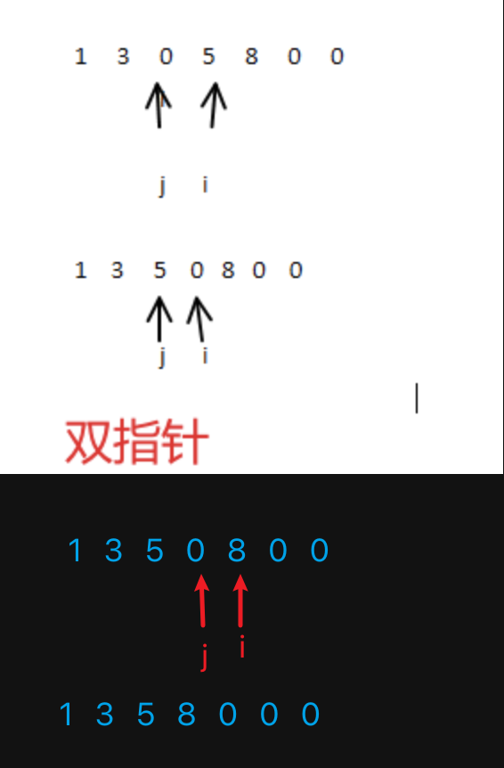

## 题目

定义一个函数，将数组种所有的 `0` 都移动到末尾，例如输入 `[1, 0, 3, 0, 11, 0]` 输出 `[1, 3, 11, 0, 0, 0]`。要求：

- 只移动 `0` ，其他数字顺序不变
- 考虑时间复杂度
- 必须在原数组进行操作

## 如果不限制“必须在原数组进行操作”

- 定义 `part1` `part2` 两个空数组
- 遍历数组，不是 `0` push 到 part1，是 `0` push 到 part2
- 返回 `part1.concat(part2)`

时间复杂度 `O(n)` 空间复杂度 `O(n)`

## 解法 1 - 传统方式

- 步骤

1. 遍历数组
2. 遇到 `0`，则 push 到数组末尾
3. 然后用 splice 截取掉当前元素

- 分析性能

1. 空间复杂度没有问题 `O(1)`
2. 时间复杂度

- 看似只遍历了一次数组，是 `O(n)`
- 但实际上，`splice` 和 `unshift` 一样，修改数组结构，时间复杂度是 `O(n)`
- 总体来看，时间复杂度是 `O(n^2)`，所以不可用

## 解法 2 - 双指针

- 指针 j 始终指向第一个 0，指针 i 指向 指针 j 之后的第一个非 0
- 交换指针 j 和指针 i 指向的数字
- 指针 i 继续往后移动
  图示：
  

- 分析性能

1. 时间复杂度 `O(n)`，因为只遍历了一次数组
2. 空间复杂度 `O(1)`

## 性能测试

- 实际对比，传统方式 和 双指针 相比差距非常大
