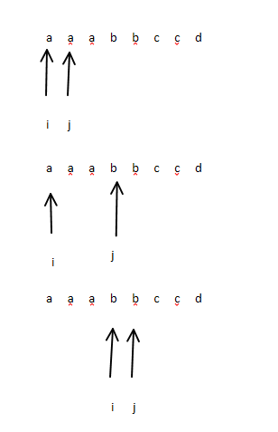
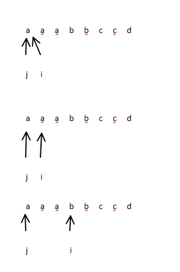

# 连续最多的字符

## 题目

给一个字符串，找出连续最多的字符，以及次数。<br>
例如字符串 `'aabbcccddeeee11223'` 连续最多的是 `e` ，4 次。

## 传统方式 - 嵌套循环

- 嵌套循环，找出每个字符的连续次数，并记录下来
- 嵌套循环，时间复杂度看似是 `O(n^2)`， **但实际上时间复杂度是 `O(n)`，因为有跳步**
- 图示：

## 双指针

- 只有一次循环，时间复杂度是 `O(n)`
- 图示：

## 其他方式

- 正则表达式 - 正则表达式效率非常低
- 使用对象记录每隔字符出现的次数

```javascript
const str = "aabbcccddeeee";
const map = {
  a: 2,
  b: 2,
  c: 3,
  d: 2,
  e: 4,
};
```

徒增空间复杂度，从 `O(1)` 到 `O(n)`<br>
时间复杂度依旧是要遍历整个字符串，还是 `O(n)`
