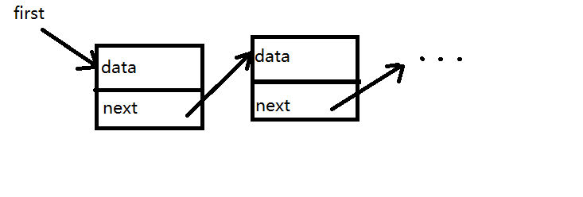

# 常见数据结构

前端开发种常见的数据结构

## 栈 Stack

栈是一种“先进后出”的数据结构。


```js
// 数组实现栈
const stack = [];
stack.push(100); // 压栈
stack.pop(); // 出栈
```

## 队列 Queue

队列是一种“先进先出”的数据结构。


```js
// 数组实现队列
const queue = [];
queue.push(100); // 入队
queue.shift(); // 出队
```

## 链表 Linked List

链表不是连续的数据结构，而是由一些列的节点组成，节点之间通过指针相连。



```ts
// 链表节点的数据结构
type ListNode = {
  data: any;
  next: ListNode | null;
};
```

## 树 Tree

树是一种有序的层级结构。每个节点下面可以有若干个子节点。例如，常见的 DOM 树。


```ts
// 树节点的数据结构
type TreeNode = {
  data: any;
  children: TreeNode[] | null;
};
```

## 二叉树

二叉树，首先是一棵树，其次，它的每个节点，最多有两个子节点，分别为 `left` 和 `right`

```ts
type BinaryTreeNode = {
  data: any;
  left: BinaryTreeNode | null;
  right: BinaryTreeNode | null;
};
```
