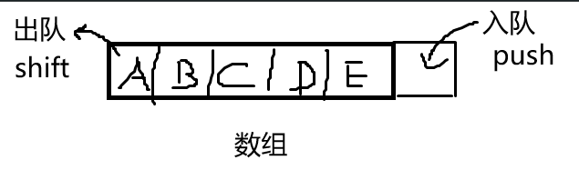
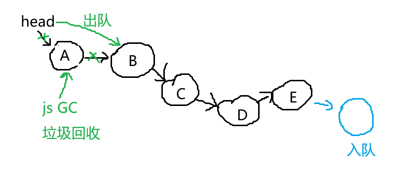
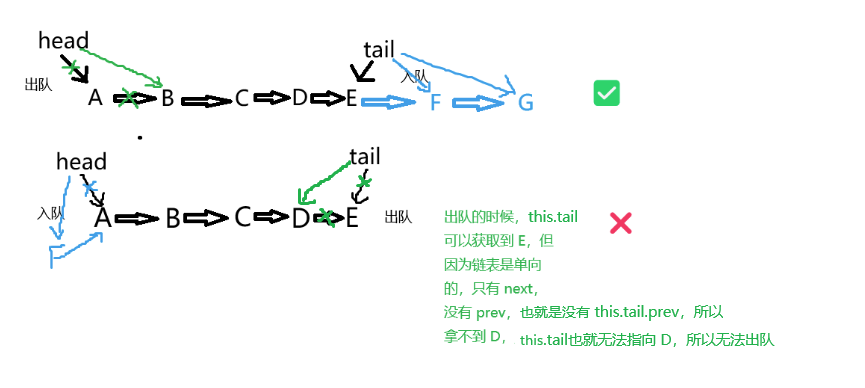

# 分析

- 数组是连续存储，push 很快，shift 很慢
- 链表是非连续存储，add 和 delete 都很快（但查找很慢）

## 数组实现队列

## 链表实现队列
  

- 使用单向链表，但要同时记录 head 和 tail，因为要出队和入队
- 链表实现队列的时候要从 tail 入队，head 出队，否则从 tail 出队的话，tail 上游的元素不好定位

- length 要实时记录，不可遍历链表去获取（遍历的话时间复杂度是 O(n) ）
