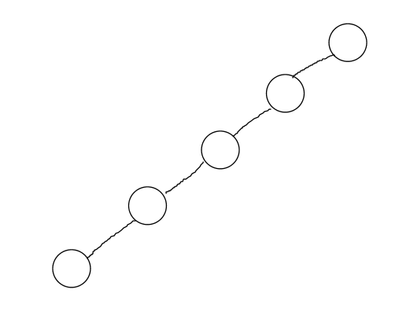

# 为何二叉树重要

## 题目
为何二叉树那么重要，而不是三叉树、四叉树呢？

## 分析
- 树，是常见的数据结构，比如 DOM 树，是一种多叉树。
- 二叉树，是一个特别的存在，很重要。

## 如何让性能整体最优？
先看两种数据结构，数组和链表。
- 数组：查找易，增删难
- 链表：增删易，查找难

如何将两者的有点结合起来呢？ 
可以使用二叉搜索树 BST，它查找易，增删易，因为可以结合 BST 的结构特点，使用二分算法

## 二叉搜索树的结构特点
- 左节点（包括其后代）<= 根节点
- 右节点（包括其后代）>= 根节点
- 图例： 

## 高级二叉树
### 二叉树不平衡的问题
二叉搜索树，如果左右不平衡，性能也无法达到最优。 
比如，极端情况下，如果二叉搜索树只有左节点，那么就变成链表，查找速度从 `O(logn)` 变成 `O(n)`。 
图例： 

### 平衡二叉搜索树 BBST
- BBST，Balanced Binary Search Tree，平衡二叉搜索树
- 增删改，时间复杂度都是 O(logn)，即树的高度

### 红黑树
- 一种自动平衡的二叉树
特点： 
- 节点分 红/黑 两种颜色，通过颜色转换来维持树的平衡
- 相比于普通平衡二叉树，它维持平衡的效率更高
- 图例：

### B 树
- 物理上是多叉树，但逻辑上是一个 BST。
- 用于高效 I/O，如关系型数据库，就用 B 树来组织数据结构
- 图例：
