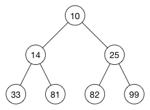

# 堆

## 堆的特点
- 节点的值，总是不大于（或不小于）其父节点的值
- 最小堆：节点的值不小于其父节点的值

- 最大堆：节点的值不大于其父节点的值
- 逻辑上是二叉树，但实际上使用数组来存储的

## 堆的规律
```js
const heap = [-1, 10, 14, 25, 33, 81, 82, 99] // 忽略 0 节点

// 节点关系
const parentIndex = Math.floor(i / 2)
const leftIndex = 2 * i
const rightIndex = 2 * i + 1
```

## 堆的排序规则
没有 BST 那么严格 <br/>
这就导致了：<br/>
- 查询比 BST 慢
- 增删比 BST 快
- 但整体的复杂度都是 `O(logn)` 级别，即树的高度
(这里类比人与人的关系，人与人关系比较疏远，那么找人的时候就慢，但是维系关系就没必要花力气)<br/>
但结合堆的使用场景
- 一般使用内存地址（栈中保存了地址，然后根据地址来查询），不会直接从根节点查询
- 堆的物理结构是数组，所以查询复杂度就是 `O(1)`

## 总结
- 物理结构是数组（空间更小），逻辑结构是二叉树（操作更快）
- 适用于“堆栈”结构


