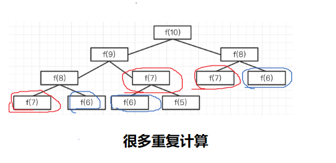

# 题目
用 Javascript 计算第 n 个斐波那契数列的值，注意时间复杂度。

## 解法1：递归计算
- 会造成很多重复计算 
- 时间复杂度是 O(2^n)，爆炸式增长，不可用（如果 n: 100，程序会卡死）
- 
- O(2^n)原因：因为递归实现会涉及到大量的重复计算，每个F(n)的计算都会分解为计算F(n-1)和F(n-2)两个子问题，而每个子问题又会分解为更小规模的子问题，以此类推。这种重复计算导致了指数级的时间复杂度。

## 解法2：循环
- 两个指针 n1, n2 不断往后移动，记录中间结果 res，只遍历一次数组，时间复杂度为 `O(n)`

## 动态规划
即，把一个大问题，拆分为不同的小问题，递归向下。 
一般使用动态规划的思路（递归）分析问题，再转换为循环来解决问题

## 三大算法思维
- 贪心（递归）
- 二分
- 动态规划

## 扩展
青蛙跳台阶：一只青蛙，一次可以跳 1 级台阶，也可以跳 2 级台阶，也可以跳 n 级台阶。求青蛙跳上 n 级台阶总共有几种方式？

- 分析
- f(1) = 1，即跳 1 级台阶，只有 1 种方式
- f(2) = 2，即跳 2 级台阶，有 2 种方式：1+1 和 2
- f(n) = f(n - 1) + f(n - 2)
- 原因：
  - 第一次跳，要么跳 1 级，要么跳 2 级
  - 如果跳 1 级，那么剩下还有 f(n-1) 种方式
  - 如果跳 2 级，那么剩下还有 f(n-2) 种方式
  - 两者相加，f(n) = f(n-1) + f(n-2)

