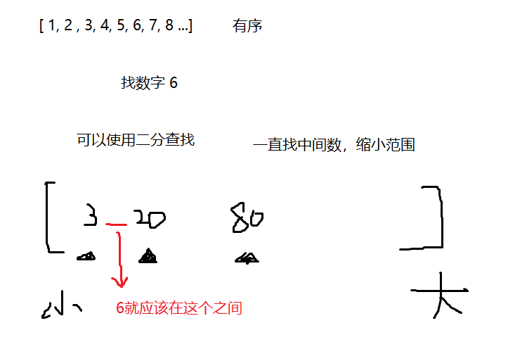

# 时间复杂度

## 概念
程序执行时需要的 CPU 计算量

## 常见的时间复杂度
- O(1) 一次就够（数量级）
- O(n) 和传输的数据量一样（数量级）
- O(n^2) 数据量的平方（数量级）
- O(logn) 数量级的对数（数量级）
- O(nlogn) 数据量 * 数据量的对数（数量级）

## 代码示例
### O(1) 一次就够（数量级）
```javascript
function fn(obj = {}) {
  // 计算 4 - 5次（读取 a, b, c 属性，然后做 2 次加法），但数量级是 O(1)
  return obj.a + obj.b + obj.c 
}
```

### O(n) 和传输的数据量一样（数量级）
```javascript
function fn(arr = []) {
  for (let i = 0; i < arr.length; i++) {
    console.info(arr[i])
  }
}
```

### O(n^2) 数据量的平方（数量级）
```javascript
function fn(arr = []) {
  for (let i = 0; i < arr.length; i++) {
    for (let j = 0; j < arr.length; j++) {
      console.info(arr[j])
    }
  }
}
```

### O(logn) 数量级的对数（数量级）
二分


### O(nlogn) 数据量 * 数据量的对数（数量级）
```javascript
// for 循环里嵌套二分
function fn(arr = []) {
  // for 循环
  for() {
    // 二分
  }
}
```
