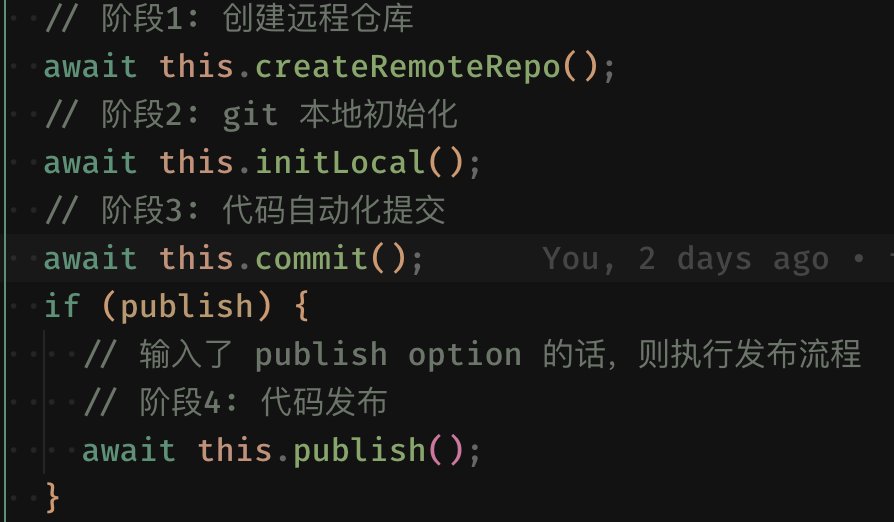

## 脚手架安装方式:

```bash
npm install -g cli-lr
```

## 脚手架功能

### 项目创建

```bash
cli-lr init my-vue-demo
```

**示例**

<video src="./创建项目.mp4" width="800" height="450" controls></video>

功能

- 选择项目模板
- 项目模板维护在数据库中，可以非常轻松的扩展更多模板
- 项目模板内容是动态化的 —— 比如在一个模版 A 中，可以根据不同需求，对于模版 A 的部分内容进行动态渲染

### 代码提交器

示例：

```bash
cli-lr commit
```

代码提交器与手动提交对比:

| 代码提交器的方式 | 手动提交的方式          |
| ---------------- | ----------------------- |
| cli-lr commit    | pnpm commit             |
|                  | git checkout develop    |
|                  | git pull origin develop |
|                  | git checkout feature-xx |
|                  | git merge develop       |
|                  | git push                |
|                  | 创建 PR 进行代码合并    |

代码提交器只需 `cli-lr commit` 之后，便可交由脚手架 **自动处理** 后续逻辑

**示例**

自动初始化远程仓库
<video src="./提交项目.mp4" width="640" height="480" controls></video>

平时进行代码迭代

<video src="./迭代.mp4" width="640" height="480" controls></video>

项目发布，增加 --publish 选项，自动创建 release tag

<video src="./发布.mp4" width="640" height="480" controls></video>

自动化步骤:


代码提交器整体逻辑：



第三步代码自动化提交具体逻辑


