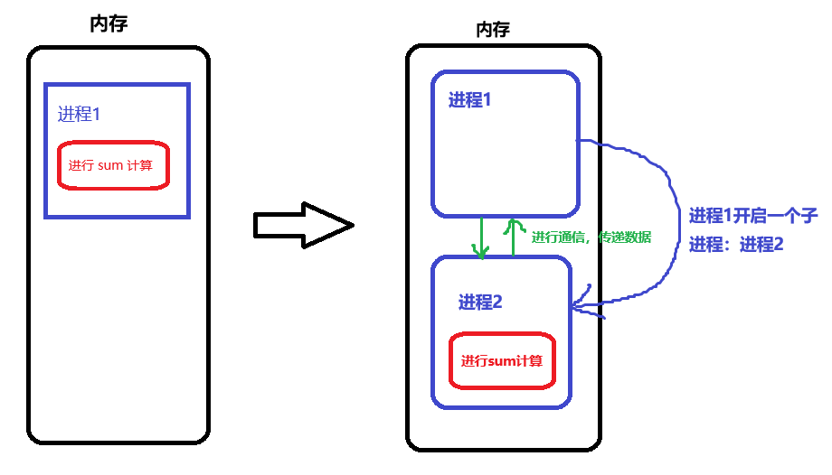

大家好，我是哈默。今天我们来说一下 Node 中如何开启多进程。

## 进程 vs 线程

首先我们要区分 2 个概念：进程 vs 线程。

进程：process，是操作系统中资源分配的最小单位，拥有独立的内存空间。

线程：thread，是操作系统中运算的最小单位，是进程的一部分，会共享进程的内存空间。

图示：


JS 是单线程的语言，但是可以开启多进程，比如使用 Web Worker 和 Node 里的一些 API。

## 为什么要开启多进程？

主要有 2 个原因：

1. 现代计算机是多核 CPU，擅长处理多进程。
2. 分配给单个进程的内存有上限，最大 2 G，而我们的电脑一般有 16 G、32 G 的内存，所以开启多个进程，才能更好的利用电脑的内存。

## 开启多进程 & 多进程通讯

进程之间默认是不能互相访问数据的，必须通过一些方式才能完成数据的交换。

最常见的方式，就是使用 fork。

我们可以用 Node 写一个 web 服务器来试一下。

首先，我们创建一个 web 服务器，监听 3000 端口，访问 /sum 路由时返回响应：

```js
const http = require("http");

const server = http.createServer((req, res) => {
  if (req.url === "/sum") {
    res.end("hello from server!");
  }
});

server.listen(3000, () => {
  console.log("server running at port 3000");
});
```

访问 /sum 路由：


现在我们在访问 /sum 路由的时候，返回 `0 - 100000` 累加的结果：

```js
function sum() {
  let res = 0;

  for (let i = 0; i < 10 * 10000; i++) {
    res += i;
  }

  return res;
}

const server = http.createServer((req, res) => {
  if (req.url === "/sum") {
    const sumRes = sum();
    res.end("sumRes is " + sumRes);
  }
});
```

此时，刷新浏览器：


现在，假设我们的 sum 方法里面要做一些消耗性能的计算。

那么我们就可以开启多进程，在子进程中进行 sum 的计算，然后将结果告知主进程。

以此，来充分利用服务器的 CPU 和内存资源，并提高整体服务器的性能。

先上个图：



主进程通知子进程开始计算，并监听子进程发送消息的事件：

```js
// 主进程 main.js
const server = http.createServer((req, res) => {
  if (req.url === "/sum") {
    // 开启子进程
    const childProcess = cp.fork("./child.js");

    // 主进程通知子进程开始计算
    childProcess.send("开始计算");

    // 主进程接收到子进程传过来的数据
    childProcess.on("message", (data) => {
      res.end("sumRes is " + data);
    });

    // 监听子进程的错误
    childProcess.on("close", () => {
      console.error("子进程报错退出");
      res.end("error");
    });
  }
});
```

子进程进行计算，计算完成后，发送结果给主进程：

```js
// 子进程 child.js
function sum() {
  let res = 0;

  for (let i = 0; i < 10 * 10000; i++) {
    res += i;
  }

  return res;
}

process.on("message", (data) => {
  const sumRes = sum();

  // 将计算结果发送给主进程
  process.send(sumRes);
});
```

这样一来，我们就实现了在 Node 中开启子进程的需求。

## 总结

我们可以在 Node 中通过 `fork API` 来开启多进程，从而尽可能的使用服务器的 CPU 和内存，来提高性能。
