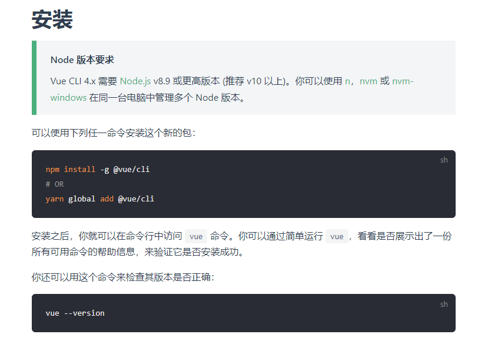
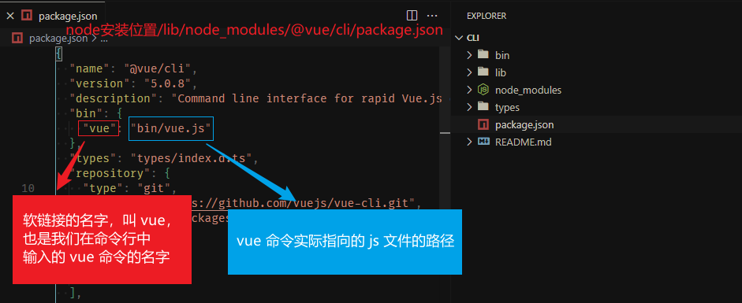
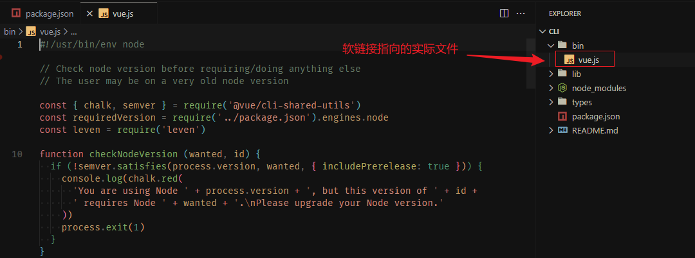
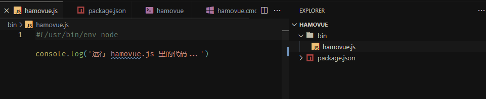
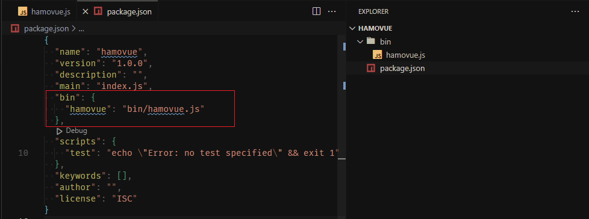

大家好，我是哈默。今天我们来简单说一下为什么当我们 `npm install -g @vue/cli` 之后，我们便可以直接使用 `vue` 命令来创建项目了。

## 一个小疑问 ❔

我们来到 [Vue CLI 官网](https://cli.vuejs.org/zh/guide/installation.html)，可以看到使用 Vue CLI 的方式非常简单：



1. npm install -g @vue/cli
2. vue xxx

大家有没有曾经对这里有过这样的一个疑问：为什么我们安装完 `@vue/cli`，我们就可以在终端里输入 `vue` 命令来执行一系列的事情了呢？为什么不是 `@vue/cli` 命令？

## 原理揭秘 🪄

我们先直接上结论，再根据结论倒推着自己实现一下，可能会更好理解一点。

其实在 `npm install -g @vue/cli` 的时候，主要就做了 2 件事情：

1. 将 @vue/cli 包下载到 node 安装位置/lib/node_modules 中：


2. 根据 @vue/cli 的 package.json 中的 bin 属性，创建一个名为 vue 的软链接，指向实际执行的文件。



对于这个 bin 属性，我们再简单的剖析一下：

`bin` 属性的值是一个对象。

这个对象的 key 指的是我们软链接的名字，也就是我们在命令行中敲的命令的名字，这里的 key 为 `vue`。

这也就意味着：如果我们将这个 key 写成 `vuehamo`，也就是：

```js
// package.json
{
  "bin": {
➡️  "vuehamo": "bin/vue.js"
  }
}
```

那么，我们就需要使用 `vuehamo create vue-demo` 来创建项目了。

这个对象的 value 是我们软链接指向的实际文件的路径，这里的 value 为 `bin/vue.js`。

我们发现，在 @vue/cli 包的 bin 文件夹底下，确实有一个 vue.js 文件：



那么这个 vue.js 文件，就是我们在执行 vue create xxx 的时候，实际执行的文件，哈默之前也写过[一篇文章](https://juejin.cn/post/7307515606006448168)分析了一下执行 vue create xxx 时候的原理。

## 自己实现一个命令 💁‍♂️

明确了原理之后，我们自己实现起来就会容易很多了，比如我们实现一个 `hamovue` 命令。

首先，我们创建一个项目 hamovue：


它就是一个 npm 的包，只要我们完成了开发，就可以把它推送到 npm 仓库上去，供大家 npm install 进行安装使用。

然后，我们创建一个 bin 目录，里面创建一个 hamovue.js 文件，里面打印一句话：



注意 ⚠️，第一行需要加上 `#!/usr/bin/env node`，原因可以看上面提到的[那篇文章](https://juejin.cn/post/7307515606006448168)。

接下来，我们知道，我们还需要在 package.json 中添加 bin 属性：



这里我们可以简化一下步骤，不必将我们的 hamovue 发布到 npm 仓库上去，而是在本地执行 `npm link` 命令，将 hamovue 变成一个全局命令：


这个时候，当我们在命令行中执行 `hamovue` 的时候，就会执行 hamovue/bin/hamovue.js 里面的代码了：


## 总结 😇

我们在 npm install -g @vue/cli 的时候，会发生如下 2 件事情：

1. 将 @vue/cli 包下载到 node 安装位置/lib/node_modules 中：

2. 根据 @vue/cli 的 package.json 中的 bin 属性，创建一个名为 vue 的软链接，指向实际执行的文件。

这样我们便可以在 npm install 完后，使用我们的 `vue` 命令了。
