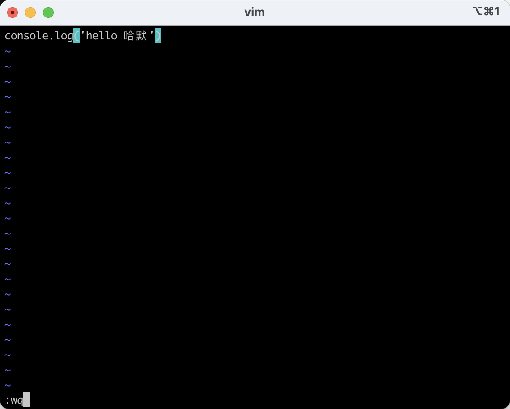

大家好，我是哈默。今天我们来简单说一下当我们使用 vue 脚手架工具 vue-cli，进行 vue create xxx 的时候发生了什么。

## vue create xxx

当我们使用 vue create xxx 的时候，我们可以得到如下的交互界面：

那么，在这背后，是执行了哪里的代码呢？

## vue

我们可以尝试在命令行中输入 `vue`：

可以看到一系列我们可以输入的指令和选项。

但如果我们输入 `vue2`，则会报错：

这里是因为：它会从我们的环境变量中找到我们的可执行文件 vue，并且执行。

但是 vue2，是找不到的，所以就会报错。

我们可以通过 `which vue` 来查看可执行文件 vue 的路径：

但我们如果通过 ll 指令，查看 vue 指令存在的文件夹的话：

会发现这里面的 `vue` 其实只是个软链接，它指向真正的文件的路径是 `../lib/node_modules/@vue/cli/bin/vue.js`。

我们查看下这个真正的 vue 文件：

在这个 vue 文件里，我们终于看到了真正执行的代码：

也就是当我们在执行 `vue xxx` 的时候，它会执行这里面的代码:

## 使用 node 执行我们的代码

在这个 vue 文件里，我们看到了第一行代码是这样一句话：

> #!/usr/bin/env node

这个是什么意思呢？

它实际上是让我们在输入 `vue xx` 执行这个 vue 文件的时候，使用 node 去执行这个文件。

我们来创建一个 js 文件测试一下。

首先我们创建一个 demo.js 的文件：

里面让它打印一句话：

这个时候我们直接执行，会告诉我们没有权限

我们给它赋予可执行的权限：

再次执行，此时可以成功执行代码，但是会报语法错误：

这个时候，我们在整个文件的开头加上和刚才 vue 文件一样的一句话，让它使用 node 来执行我们的 demo.js：

再次执行 demo.js，成功打印出了 `hello 哈默`：

和我们直接 `node ./demo.js` 是一样的效果：

## 总结

当我们执行 vue create vue-demo 的时候，我们会从系统的环境变量里找到 vue 可执行文件进行执行，它是一个软链接，最终会找到真实的 vue 文件，并执行里面的代码。
