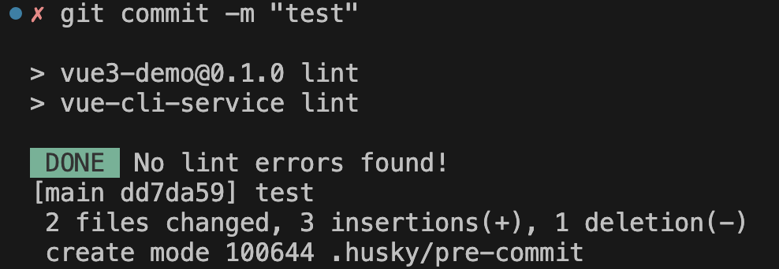
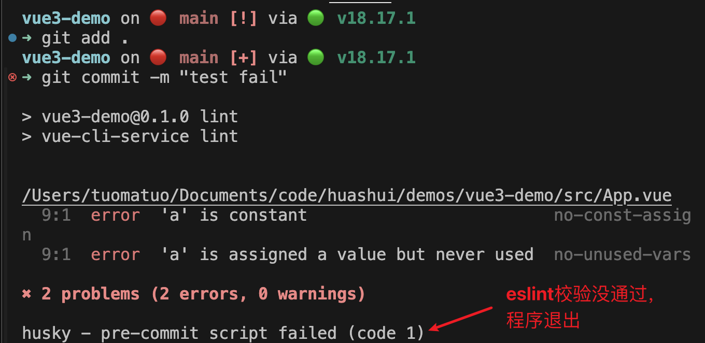
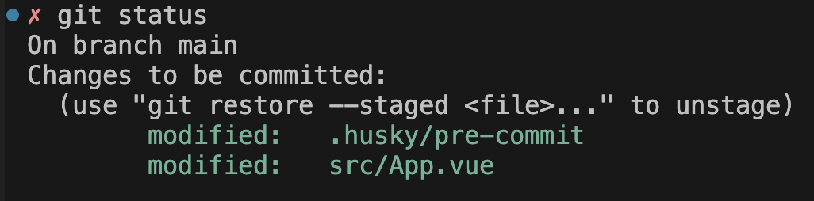
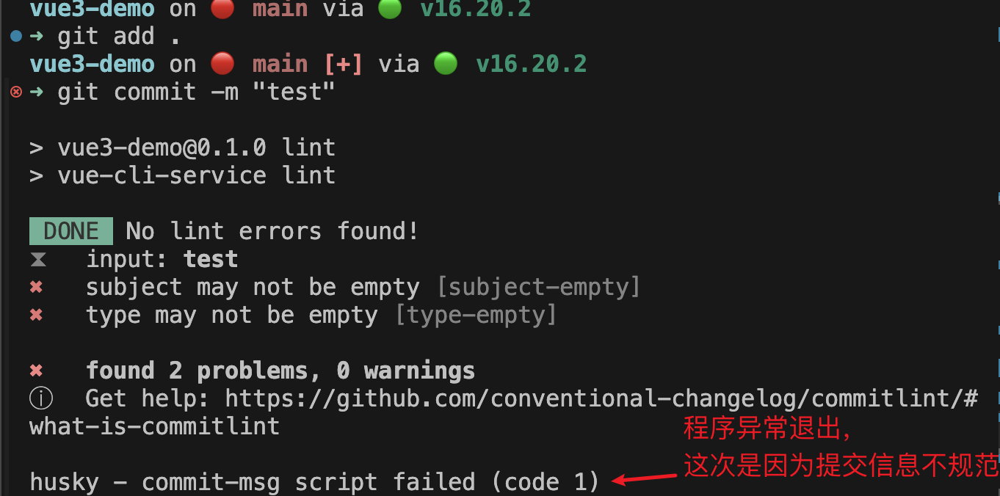
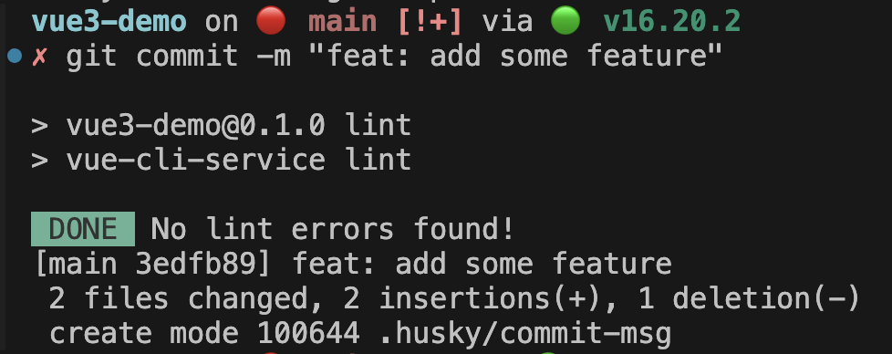

我们在日常开发中，除了编码之外，还有很多规范需要遵守。

好的规范可以：
- 减少代码错误（如 eslint 能检查出来的错误）
- 良好且标准的代码提交记录，方便回溯代码

为了达到这 2 点，我们可以分别使用 `husky` 和 `commitlint` 来做。

## 使用 husky
我们可以使用 husky 来配置在 git commit 之前来执行某个钩子函数，如：
执行 eslint 来检查我们的代码。

我们可以首先通过 vue-cli 创建一个 vue3 项目：

```bash
vue create vue3-demo
```

创建的时候，需要选择 eslint。

然后，我们可以使用 2 种 husky 官网推荐的方法来在项目中集成 husky:

- npm install 方式
- husky init 脚手架方式

这里官方推荐第 2 种。

我们可以在命令行中输入如下命令，使用 husky 脚手架，并执行它的 init 命令，来在我们的项目中配置 husky。
```
npx husky init
```

执行完 init 命令后，我们的项目的根目录中，将会多出一个 `.husky/pre-commit` 文件，这个文件里的代码将会在我们执行 git commit 命令时被执行。

我们将 `pre-commit` 文件里写入 npm run lint。

也就是在 git commit 前，执行 npm run lint 命令。

而在 package.json 中，npm run lint 命令，实际对应的是 `使用 eslint 进行语法检查`：
```js
// package.json 中
{
  "name": "vue3-demo",
  ...,
  "scripts": {
    ...,
    "lint": "vue-cli-service lint", // 实际执行的是这句命令
  }
}
```

我们现在执行 git add, git commit, 可以看到在 git commit 前，确实执行了 eslint 进行语法检查:




只有当 eslint 检查通过，我们才能够 commit 成功。

如果失败的话，我们的 commit 就不会执行。

我们在 App.vue 中加入如下代码：
```vue
<script>
const a = 1
a = 2 // 明显语法有误！！
</script>
```

此时，我们再次 git add, git commit：



首先看到 eslint 校验失败后，整个程序就退出了，code 为 1。

然后我们通过 git status 来查看下文件的状态，可以看到是`尚未提交`的状态。



也就是，如果 eslint 检查失败的话，我们的 git commit 不会成功执行。

至此，我们完成了 husky 配置 pre-commit 钩子的工作，在 git commit 前，先对语法进行检查，如果未通过，则阻止提交。

## 使用 commitlint
通过 eslint，我们确保了代码的语法没有问题，但是我们刚才的提交信息却写的十分随意，比如 `test` 等等。

我们很难看出这次提交的目的是什么。

在 git log 中，我们也没有记录下有用的信息，供日后回溯我们的代码。

我们能不能够如果检查代码规范一样，也检查一下我们提交信息的规范呢？

这个时候，`commitlint` 就出来了。

从它的名字，我们也可以看出，它是对我们的提交信息，进行格式校验的。

那么，让我们来集成一下它到我们当前的项目中，并且配合 husky 进行使用。

首先，我们来安装一下依赖：

```bash
npm install --save-dev @commitlint/{cli,config-conventional}
```

然后，创建 commitlint 的配置文件，`commitlint.config.js`，并配置我们需要使用它的 conventional config，常规配置。

我们可以通过命令的方式来创建这个配置文件:

```bash
// 将 echo 后的内容写入到 commitlint.config.js 文件中
echo "export default { extends: ['@commitlint/config-conventional'] };" > commitlint.config.js
```

同时，我们还需要在 package.json 中，加入 commitlint 的配置：
```js
{
  "name": "vue3-demo",
  ...,
  "commitlint": {
    "extends": [
      "@commitlint/config-conventional"
    ]
  }
}
```

并且再在 husky 里配置一个 commit-msg 的钩子，里面写入如下代码：
```bash
echo "npx --no -- commitlint --edit $1" > .husky/commit-msg
```

此时，我们再次进行代码提交，提交信息填写 `test`，发现就不给通过了：



我们将提交信息改为 `feat: add some feature` 这种规范的格式，发现成功通过：



至此，我们通过 commitlint 工具规范了我们的提交信息。

## 总结
在日常编码的过程中，除了业务逻辑的编写之外，我们还可以使用一些工具，提高我们的代码质量。

这里我们介绍了 2 种：
- husky 配置 pre-commit 钩子，在 git commit 前，使用 eslint 检查我们的代码
- commitlint 检查我们的提交信息的规范


