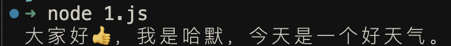
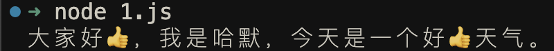

大家好，我是哈默。`indexOf` 是我们非常熟悉的一个方法，它可以用来获取某一个元素在一个数组里的位置，我们一般就会使用 `array.indexOf(element)` 的方法来进行使用。

但是，大家有没有使用过 indexOf 的`第二个参数`呢？第二个参数的使用会经常出现在一些优秀的库的源码当中，用于依次分析（或者说扫描）某一个字符串。

比如命令行美化输出的 `chalk` 库中就有此应用，因为 chalk 库的原理就是对于我们输出在终端的内容进行处理，然后将处理后的字符串显示在终端上。

## indexOf 基本用法

首先，我们还是先来回顾一下 `indexOf` 的最基本用法。

给定一个数组：`[10, 20, 30]`，寻找这个数组中 `30` 的位置，是 `2`。

```js
const arr = [10, 20, 30];
const element = 30;
const index = arr.indexOf(element);

console.log(index); // 2
```

## indexOf 的第二个参数

明确了 indexOf 的基本用法以后，它的第 2 个参数有什么用呢？

其实是起到了一个调整从哪里开始查找的作用。

我们来看一个例子：

```js
const arr = [10, 20, 30];
const element = 10;
const index = arr.indexOf(element);

console.log(index); // 0

const arr2 = [10, 20, 30, 10];
const element2 = 10;
const index2 = arr2.indexOf(element2, 1);

console.log(index2); // 3
```

可以看到，同样是查找 `[10, 20, 30, 10]` 当中 10 的位置，但是因为第一次是从数组第 1 个元素开始查找的，所以得到的结果是 0。

而第二次是从数组的第 2 个元素开始查找的，所以得到的结果是 3。

## 优秀库源码里的使用

明确了 indexOf 第二个参数的使用之后，我们再来看一下在一些优秀的库的源码里面，它们是如何利用起这个第二个参数的作用的。

> ⚠️ 注意：我下面会以 `String.prototype.indexOf` 举例，而上面举的例子是以 `Array.prototype.indexOf` 为例，但是这两个 API 的第二个参数都是起到一个搜索位置的作用，所以在这里可以一起学习一下

这里，我们只会分析它的思想，具体的实现在具体的源码里会存在差异，但思想是相同的。

我们首先定义一个方法，`addEmoji`，接受三个参数：

```js
/**
 * 在一个 string 的 targetString 后面，加上一个 emoji
 * @param string 原始 string
 * @param targetString 加 emoji 的那个 string
 * @param emoji 加入的 emoji
 * @returns 处理后的最终结果
 */
function addEmoji(string, targetString, emoji) {
  let result = "";

  // 一系列处理
  // ...

  return result;
}
```

我们最终会这样调用，在 `大家好，我是哈默，今天是一个好天气。` 的 `好` 这个字的后面，加上 👍 的 emoji：

```js
const res = addEmoji("大家好，我是哈默，今天是一个好天气。", "好", "👍");
console.log(res);
```

那么首先我们就可以使用 indexOf 方法来从输入的字符串里找到 `好` 的位置：

```js
function addEmoji(string, targetString, emoji) {
  // 找到 targetString 的位置
  let index = string.indexOf(targetString);

  let result = "";

  // 记录当前扫描到的位置，现在是在参数 string 的开头位置
  // 因为 string 当中，可能会存在多个 targetString，所以我们会跳着进行扫描，也就是会使用 indexOf 的第二个参数
  let currentScanIndex = 0;

  return result;
}
```

如果我们找到了 targetString，即 `index !== -1`，那么我们就在 targetString 后，加上一个 emoji：

```js
function addEmoji(string, targetString, emoji) {
  // 找到 targetString 的位置
  let index = string.indexOf(targetString);

  let result = "";

  // 记录当前扫描到的位置，现在是在参数 string 的开头位置
  // 因为 string 当中，可能会存在多个 targetString，所以我们会跳着进行扫描，也就是会使用 indexOf 的第二个参数
  let currentScanIndex = 0;

  // 如果找到了 targetString
  if (index !== -1) {
    // 在 targetString 后面增加 emoji
    result += string.slice(currentScanIndex, index) + targetString + emoji;
    // 将当前扫描位置，移动到 targetString 之后的那个位置上
    currentScanIndex = index + targetString.length;
  }

  // 将 targetString 之后的内容追加到 result 里
  result += string.slice(currentScanIndex);

  return result;
}
```

此时，我们在第一个 `好` 字后面，加上了 `👍`，得到的结果：



但是，我们这个字符串中，还有一个 `好天气` 的 `好`，也就是存在多个 `targetString`，所以我们这里不能是 `if` 只执行一次，而是要做一个循环。

我们可以使用一个 while 循环：

```diff
function addEmoji(string, targetString, emoji) {
  // 找到 targetString 的位置
  let index = string.indexOf(targetString);

  let result = "";

  // 记录当前扫描到的位置，现在是在参数 string 的开头位置
  // 因为 string 当中，可能会存在多个 targetString，所以我们会跳着进行扫描，也就是会使用 indexOf 的第二个参数
  let currentScanIndex = 0;

  // 如果找到了 targetString
  while (index !== -1) {
    // 在 targetString 后面增加 emoji
    result += string.slice(currentScanIndex, index) + targetString + emoji;
    // 将当前扫描位置，移动到 targetString 之后的那个位置上
    currentScanIndex = index + targetString.length;
+   // 重点来了！！！我们要从当前扫描的位置开始，去寻找 targetString
+   index = string.indexOf(targetString, currentScanIndex);
  }

  // 将 targetString 之后的内容追加到 result 里
  result += string.slice(currentScanIndex);

  return result;
}
```

此时，我们便成功的给第二个 `好`，也加上了 emoji：



这个地方我们就使用到了之前提到的 indexOf 的第二个参数：

```js
// 重点来了！！！我们要从当前扫描的位置开始，去寻找 targetString
index = string.indexOf(targetString, currentScanIndex);
```

我们是从当前扫描到的位置 `currentScanIndex` 开始，查找 `targetString` 的，这样我们就可以找到下一个 `targetString` 了。

所以，这里的思想就是通过 indexOf 的第二个参数，帮助我们能够依次扫描一个字符串，依次找到我们想要找的那个元素的位置，然后做相应的处理。

## 总结

indexOf 的第二个参数，叫 `fromIndex`，看到这里，大家应该也能很好的理解这个 `fromIndex` 的作用了，就是从哪里开始找嘛！
