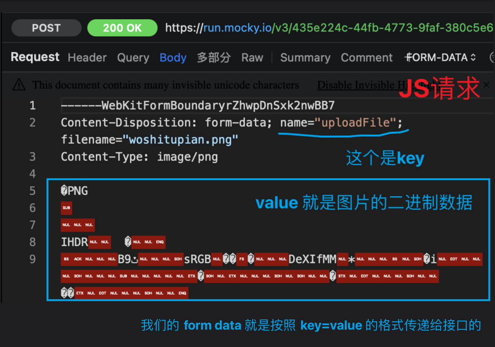

大家好，我是哈默。上传文件是我们日常开发中经常碰到的一个需求，我们平常使用的 ElementUI 和 Antd 也都提供了现成的上传组件。

但是上传文件的原理是什么呢？今天我们一起来通过一个简单的例子🌰一起来学习一下。

## 上传文件的2种方式📖
上传文件有 2 种方式：
1. 通过 form 表单
2. 通过 JavaScript 发送异步请求

其中 JS 发送异步请求的方式，其实也是模拟了 form 表单提交来实现的。

## 通过表单上传文件📝
首先，我们定义一个表单，method 为 post，action 就是上传文件的接口地址。

此外，我们还有两个 input，一个是选择上传文件用的，type 为 `file`，还有一个就是普通的 input。

最后我们还有一个提交的按钮。
```js
<form 
  method="post" 
  enctype="multipart/form-data"
  action="https://run.mocky.io/v3/435e224c-44fb-4773-9faf-380c5e6a2188"
>
  <input type="file" name="uploadFile" />
  <input type="text" name="userName" />
  <button type="submit">提交</button>
</form>
```

现在我们开始上传一个叫做 woshitupian.png 的图片：


## 两点注意事项📢
这里有两点需要特别注意。

首先，当我们上传文件的时候，和普通的表单提交有所不一样。

我们除了将一些信息以字符串的形式传给接口之外，还传递了文件信息，这些文件信息是以 `二进制的格式` 进行传递的。

`普通的表单提交`，信息以字符串的形式提交给接口：

```js
<form 
  method="post" 
  action="https://run.mocky.io/v3/435e224c-44fb-4773-9faf-380c5e6a2188"
>
  <input type="text" name="userName" />
  <input type="text" name="city" />
  <button type="submit">提交</button>
</form>
```

填写内容：


提交给接口的参数：


而`上传文件`的时候，我们选择上传一张名为 `woshitupian.png` 的图片，并在普通输入框填写 `100`：


提交给接口的参数：


第二点注意事项来了❗

在 `<form>` 元素上，有一个 `enctype` 属性，这个属性的默认值是 `application/x-www-form-urlencoded`。

而当我们上传文件的时候，这个属性的值应该设置为 `multipart/form-data`，否则传递给接口的参数会缺失`上传文件的文件信息`：

代码：
```js
<form 
  method="post" 
  action="https://run.mocky.io/v3/435e224c-44fb-4773-9faf-380c5e6a2188"
>
  <input type="file" name="uploadFile" />
  <input type="text" name="userName" />
  <button type="submit">提交</button>
</form>
```

传递给接口的参数:


## 通过 JS 发送异步请求🎅
使用 form 表单上传文件的时候有一个问题，就是页面会进行跳转，会离开我们当前的页面：


而使用 JS 发送异步请求的方式，可以完美解决这个问题。

当我们选择完一个文件，我们就可以发送一个 POST 请求，也就是在 `input[type="file"]` 的 change 事件的时候。

同时，我们注意到，form 表单提交其实就是发送了一个 POST 请求：


而我们使用 JS 发送 POST 请求，其实就是模拟了 form 表单发送一个 POST 请求。

最后一个小细节，我们给 `<form>` 元素设置的 `enctype` 属性，其实最后在发送 POST 请求的时候，会被设置到 `Content-Type` 这个请求头中:


明确了上面的几点之后，我们的 JS 发送异步请求的代码也就呼之欲出了：

```vue
<template>
  <form 
    method="post" 
    enctype="multipart/form-data"
    action="https://run.mocky.io/v3/435e224c-44fb-4773-9faf-380c5e6a2188"
  >
    <!-- 选择文件之后，执行 onFileChange 函数 -->
    <input type="file" name="uploadFile" @change="onFileChange" />
    <input type="text" name="userName" />
    <button type="submit">提交</button>
  </form>
</template>

<script setup>
import axios from 'axios'

// 选择文件之后，执行 onFileChange 函数 
function onFileChange(e) {
  // 获取到 type="file" 的 input 元素
  const target = e.target
  // 获取上传的文件
  const files = target.files
  // 如果文件存在
  if (files) {
    // 获取到上传的文件
    const uploadFile = files[0]
    console.log('uploadFile', uploadFile);
    // 定义 form data，form data 的数据结构和我们使用 form 表单提交时的数据结构一致
    const formData = new FormData()
    // 添加 uploadFile 字段，值为我们上传的文件的二进制数据
    formData.append('uploadFile', uploadFile)
    // 发送 POST 请求
    axios.post('https://run.mocky.io/v3/435e224c-44fb-4773-9faf-380c5e6a2188', formData, {
      headers: {
        // 设置 Content-Type 为 multipart/form-data 的请求头
        'Content-Type': 'multipart/form-data'
      }
    }).then(res => {
      console.log(res)
    })
  }
}
</script>
```

检查一下我们之前说的几点细节：




## 总结🎁
到这里，恭喜你已经掌握了文件上传的基本原理🎉🎉🎉，并且对其中的各种小细节也有了认识，比如:

- 上传的图片以二进制格式传递
- multipart/form-data 请求头

...
