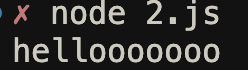
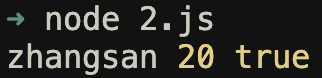
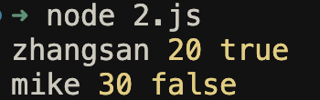

大家好，我是哈默。数组相关的一些操作大家一定都不陌生，今天我们就来讲下下面三种和数组有关系的语法的妙用。

1. 二维数组
   `[['zhangsan', 'lisi', 'wangwu']]`
2. 扩展运算符
   `...[1, 2, 3] => 1, 2, 3`
3. rest 参数
   `function fn(...params) {}`
4. 数组的解构赋值
   `let [a, b, c] = [1, 2, 3];`

## 举个例子 🌰

如果我们现在有一个函数 `greeting`：

```js
function greeting(word) {
  console.log(word);
}
```

我们调用时，可以传一个参数 `word`：

```js
const word = "hellllllo";
greeting(word);
```

结果：


如果此时，我们将这个功能抽象成一个类，实现一个复用。

以后需要用到 greeting 功能的时候，直接到类里去找就可以了：

```js
class MyClass {
  constructor(word) {
    greeting(word);
  }
}

const word = "hellooooooo";
const mc = new MyClass(word);
```

结果：



一切都非常丝滑～～很完美！

## 处理 1 个参数的函数

我们刚才的 greeting 函数，它只接收了 1 个参数，但有的时候，我们会有多个参数的情况，比如：

```js
function printInfo(name, age, isChinese) {
  console.log(name, age, isChinese);
}
```

这个 `printInfo` 方法，接收三个参数，调用的时候，我们就需要挨个定义出这三个变量，然后传入：

```js
// 这里我们分别定义了 3 个变量，因为我们后续要通过类的构造函数将这些参数传入，所以 printInfo() 调用时的值应该是外部传入的
const name = "zhangsan";
const age = 20;
const isChinese = true;

printInfo(name, age, isChinese);
```

结果：



所以我们抽象成类的时候，也需要这么做：

```js
class MyClass {
  constructor(name, age, isChinese) {
    printInfo(name, age, isChinese);
  }
}

const name = "zhangsan";
const age = 20;
const isChinese = true;
const mc = new MyClass(name, age, isChinese);
```

结果：


可以看到，非常麻烦，我们要定义 3 个变量。

如果我们想定义 1 个变量就搞定，我们可以用 `数组` 来对我们的代码进行改造：

```js
function printInfo(name, age, isChinese) {
  console.log(name, age, isChinese);
}

// 定义一个数组，数组里面包含了我们的 3 个数据
const arr = ["zhangsan", 20, true];
printInfo(...arr);
```

结果依旧不变：


现在我们只有 1 条 `zhangsan` 的数据。

## 一次性处理多条数据 - 使用二维数组

但假如，我们想要一次性打印出多条数据，该如何处理呢？

我们可以再次修改数据结构，使其变成 `二维数组`：

```js
const arr = [
  ["zhangsan", 20, true],
  ["mike", 30, false],
];
```

并对我们传入的 `arr` 进行遍历，使用 `扩展运算符`将每条数据的每个字段依次传入 `printInfo`：

```js
function printInfo(name, age, isChinese) {
  console.log(name, age, isChinese);
}

arr.forEach((item) => {
  printInfo(...item);
});
```

结果：



ok，那现在我们再来封装下我们的类：

```js
function printInfo(name, age, isChinese) {
  console.log(name, age, isChinese);
}

class MyClass {
  constructor(arr) {
    arr.forEach((item) => {
      printInfo(...item);
    });
  }
}

const arr = [
  ["zhangsan", 20, true],
  ["mike", 30, false],
];
const mc = new MyClass(arr);
```

结果依旧相同：


好了，到这里，我们就使用了 `二维数组 + 扩展运算符` ，使我们能够同时处理多条数据啦。

## rest 参数 & 解构赋值

有的时候，我们函数接收的参数可能是由我们使用的框架或者库给我们动态传入的，也就是参数个数是不确定的。

比如在 case1 时，第三方库会给我们的函数传入 2 个参数：

```js
function fnByUs1(a, b) {
  console.log(a, b);
}

function fnByLibCase1() {
  fnByUs1(10, 20);
}

fnByLibCase1();
```

结果：


但 case2 时，因为我们使用第三方库的方式不同，第三方库会给我们传入 3 个参数：

```js
function fnByUs2(a, b, c) {
  console.log(a, b, c);
}

function fnByLibCase2() {
  fnByUs2(10, 20, 30);
}

fnByLibCase2();
```

结果：


那么这个时候，如果我们想要将我们的方法所接收到的不确定个数的参数，一次性都接收过来，我们可以使用 rest 参数语法：

```js
// 使用...params一次性接收所有的参数
function fnByUs2(...params) {
  // 直接传给另一个函数
  utils(params);
}

// 另一个函数可以通过解构的方式，得到所有的参数
function utils([a, b, c]) {
  console.log(a, b, c);
}

function fnByLibCase2() {
  fnByUs2(10, 20, 30);
}

fnByLibCase2();
```

结果：


## 总结

今天我们学习了一下数组相关的一些操作：

- 二维数组
- 扩展运算符
- rest 参数
- 解构赋值的妙用

希望可以让大家对于这些操作有一个新的认识～
