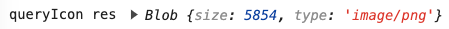
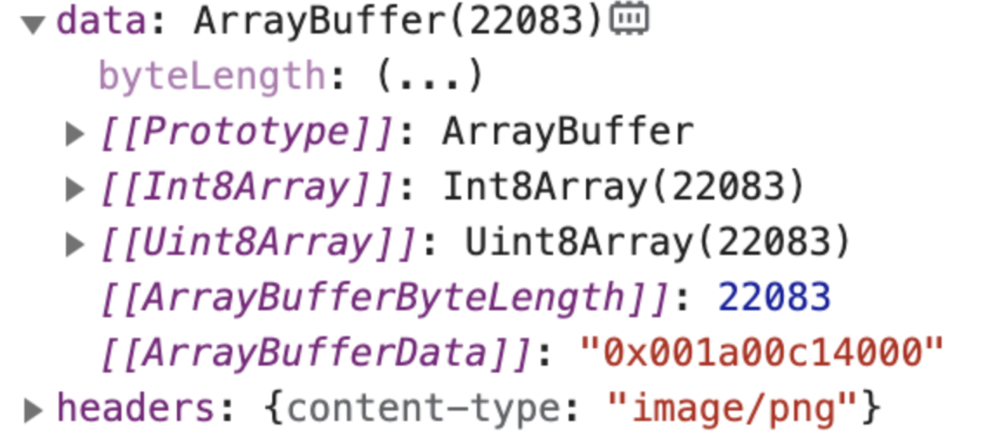
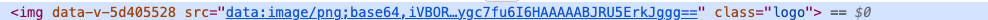

当我们请求一个接口的时候，很多情况下，我们会直接得到一个 json 数据：

```js
{
  "userId": 1,
  "id": 1,
  "title": "delectus aut autem",
  "completed": false
}
```

但有时候，当我们请求一个图片的时候，接口可能直接给我们返回一个二进制的数据：

```

IHDRddp�TsRGB���DeXIfMM*�i��d�d
/��AHIDATx�]	|U��^]ݝ$@@EAEY]���h�vg�QTgqѸގ�#;�����p�8
�#���""�����U����N�NL 	՝�0�����U�����w��*D)^����O���ͨ#_�;J�a�u��x�����mB=�S�ţ�
H�]��t�=4`�x�^�R�$��a�7L��
ۤ�ڹ��� 1�Gr�RL����"�v�n?��Ȫ��;IY@�E��ACHJ���^7�A�Tsa�aP�ܔD׌�
K�	��M3�U��)v�����r�P�D7WJ�8o��=S�:rS�!�uӅ8M(��v���&Ӑ2e�VJ�٢�f�"#�g�W��u].�R]�w
�5�l�c7�`܅)�L1,\rS��]#꣒ݳ��4q��DO��)�'%�u
�Y�xf~����n���bX�� E�`;� $�!
7u��������*{�{���͌���h�(٩���b�������O@U)�O�]�ǧ`I9�EXX�AG�	��*�!SJ9@(�����	�3 �
T��	H8�����B{ �h��������SNB*���5�/t�"�ƹ+`�65�kr_mB���&�l���у�&̫�J�f"R7��m���@�NU�ҿ���)p�S	9q
J^�OWOj���Mah0��͚P{�.�ה�H���2�ʦ,��J�(�k�
�lo��)xǖ�eeWmi�[K�R\�Ej�x%UhǞR����i�0b�q�f�����♡������������ߙ����
/�s�7E���8��Ʈ�������J�>��֙�M���e��]KΏ1,��D+��0��C�+�iYG�@*u��N?!UWa��xX*m��o�a�*8y��`0
}��������F��������#B�
�O"�{9��C��Zhը�/�Azq���wp=+H�,Q�
C]՟Ԁw�
```

## 解决方法1：将二进制数据转化为 blob
```js
{
  // `responseType` indicates the type of data that the server will respond with
  // options are: 'arraybuffer', 'document', 'json', 'text', 'stream'
  //   browser only: 'blob'
  responseType: 'blob'
}
```

这个时候，响应会变成一个 blob 对象：



此时，我们便可以将它转换为 url：
```js
// js
const srcValue = URL.createObjectURL(res.data);

// html

```

最终效果：


## 解决方法2：将二进制数据转化为 arrayBuffer
这个时候，我们需要将 responseType 设置为 arrayBuffer，比如 axios 里可以[这样](https://github.com/axios/axios#request-config)配置：
```js
{
  responseType: 'arraybuffer'
}
```

这个时候，响应会变成一个 arrayBuffer 对象：



此时，我们便可以将它转换为 base64 字符串：
```js
const base64ImageString = Buffer.from(res.data, 'binary').toString('base64')
```

最后，我们如果想在 img 的 src 属性里使用，只需要在前面加上 base64 的前缀即可：
```js
// js
const srcValue = "data:image/png;base64,"+base64ImageString

// html

```

最终效果：




