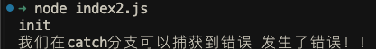

大家好，我是哈默。对于程序执行过程中异常的捕获，能使我们的程序更具健壮性，那么今天我们一起来看一下关于 `异常捕获` 的一些事吧。

## 基本使用

假如现在我们有一个方法 `init`：

```js
function init() {
  console.log("init");
}

init();
```

现在，当我们执行这个 init 方法的时候，我们会在控制台得到一个 `init`。

但随着 init 里的逻辑越来越多，可能哪一天在程序执行的时候，就会产生报错。

那么，我们可以在函数体里使用 `try...catch...` 来捕获可能发生的异常。

```js
function init() {
  try {
    console.log("init");

    throw new Error("发生了错误！！");
  } catch (error) {
    console.log("我们在catch分支可以捕获到错误", error.message);
  }
}
```

执行代码：

