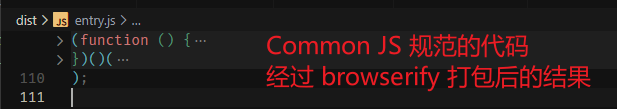
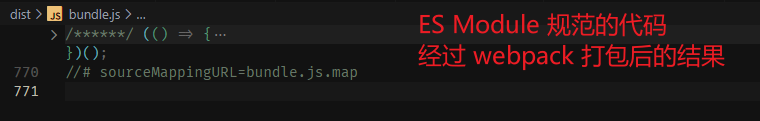

大家好，我是哈默。今天我们来简单说一下前端模块化的发展。

## 背景

我们的页面是由 html, css, js 组成的，我们将逻辑放到了 js 里编写。随着逻辑越来越多，越来越复杂，js 文件也会越来越长，并难以阅读。

这个时候，我们就需要将不同的逻辑拆分到不同的模块。

- 一个模块包含输入和输出
- 模块内部的实现是私有的，对外暴露接口与其他模块进行通信

前端模块化只是一种标准，并不是具体的实现，那么具体实现模块化的方式也是逐步进行演化的。

## 使用全局函数

最简单最直接的方式，就是可以将不同逻辑封装到不同的函数中。

```js
function request() {
  return {
    code: 200,
    data: {
      scores: [90, 95, 88, 35, 55, 91],
    },
  };
}

function average(scores) {
  const total = scores.reduce(function (res, score) {
    return res + score;
  }, 0);

  return `你的平均分是${total / scores.length}。`;
}

function fail(scores) {
  const failScores = scores.filter((score) => score < 60);

  return `很抱歉，你有${failScores.length}次不合格。`;
}

const scores = request().data.scores;
console.log("average", average(scores));
console.log("fail", fail(scores));
```

这种方式的缺点也很明显，我们定义的 `request、average、fail` 函数，都是定义在 window 对象上的，如果我们引入了第三方或者其他小伙伴的 js，那么很难保证他们没有也去定义同名的函数，特别是当我们的函数名取的比较通用的时候，比如 `add`。

所以，全局函数的方式容易引发命名冲突。

## 使用全局 namespace

要解决 `全局函数` 的问题，我们可以把这些函数的定义放入一个对象中，比如 `__module__`：

```js
var __module__ = {
  request() {
    return {
      code: 200,
      data: {
        scores: [90, 95, 88, 35, 55, 91],
      },
    };
  },
  average(scores) {
    const total = scores.reduce(function (res, score) {
      return res + score;
    }, 0);

    return `你的平均分是${total / scores.length}。`;
  },
  fail(scores) {
    const failScores = scores.filter((score) => score < 60);

    return `很抱歉，你有${failScores.length}次不合格。`;
  },
};

var m = window.__module__;
const scores = m.request().data.scores;
console.log("average", m.average(scores));
console.log("fail", m.fail(scores));
```

通过这种方式，我们避免了直接将 `request、average、fail` 定义在 window 对象上，而是定义在 `__module__` 上，而 `__module__` 的名字，一般也很难与其他人冲突，如果我们取的名字在长一些的话。。。

但这种方式的问题就是：外部可以随意修改 `__module__` 内部的数据:

```js
var __module__ = {
  num: 100,
  request() { ... },
  average(scores) { ... },
  fail(scores) { ... },
};

var m = window.__module__;

m.num = 200; // 可以随意修改模块内部的数据🤐

```

这违反了我们之前对于模块的定义：

> 模块内部的实现是私有的，对外暴露接口与其他模块进行通信

## 使用 iife

解决 `namespace` 方案的问题，可以通过 `iife` 自执行函数来创建闭包：

```js
(function (global) {
  var num = 100;

  function request() {
    return {
      code: 200,
      data: {
        scores: [90, 95, 88, 35, 55, 91],
      },
    };
  }

  function average(scores) {
    const total = scores.reduce(function (res, score) {
      return res + score;
    }, 0);

    return `你的平均分是${total / scores.length}。`;
  }

  function fail(scores) {
    const failScores = scores.filter((score) => score < 60);

    return `很抱歉，你有${failScores.length}次不合格。`;
  }

  function getNum() {
    return num;
  }

  function setNum(newValue) {
    num = newValue;
  }

  global.__module__ = {
    request,
    average,
    fail,
    getNum,
    setNum,
  };
})(window);

const m = window.__module__;
const scores = m.request().data.scores;
console.log("average", m.average(scores));
console.log("fail", m.fail(scores));
```

现在我们无法直接访问 num 变量了，只能通过模块内部提供的 getNum、setNum 来对 num 进行操作:

```js
console.log(m.getNum());
m.setNum(200);
console.log(m.getNum());
```

这种方式，是比较完美的，它让我们的数据更安全了。

但是，这仅限于我们只有一个模块的时候。

如果我们有多个模块，并且模块之间还存在着依赖，我们如何让一个模块去引用另一个模块呢？

## iife + 传参

比如，我们有如下两个模块。

request 模块：

```js
(function (global) {
  function request() {
    return {
      code: 200,
      data: {
        scores: [90, 95, 88, 35, 55, 91],
      },
    };
  }

  global.__module__ = {
    request,
  };
})(window);
```

handle 模块：

```js
(function (global) {
  function average(scores) {
    const total = scores.reduce(function (res, score) {
      return res + score;
    }, 0);

    return `你的平均分是${total / scores.length}。`;
  }

  function fail(scores) {
    const failScores = scores.filter((score) => score < 60);

    return `很抱歉，你有${failScores.length}次不合格。`;
  }

  global.__module__ = {
    average,
    fail,
  };
})(window);
```

很明显，handle 模块是需要依赖 request 模块的数据的，那么此时，我们可以通过 `传参` 的形式，将 handle 模块传入 request 模块中。

request 模块改造一下：

```diff
 (function (global) {
   function request() { ... }

-  global.__module__ = {
-    request,
-  };

+  global.__module_request__ = {
+    request,
+  };
 })(window);
```

handle 模块也相应改造下：

```diff
- (function (global) {
+ (function (global, req) {
    function average(scores) { ... }

    function fail(scores) { ... }

    global.__module__ = {
+     req,
      average,
      fail,
    };
- )(window);
+ })(window, window.__module_request__);

+ const m = window.__Module;
+ const scores = m.req.request().data.scores;
+ console.log(m.average(scores));
+ console.log(m.fail(scores));
```

我们在定义 handle 模块的时候，将 request 模块作为第二个参数传入 iife 内部，这样我们就可以访问到 request 模块里的 request 方法了。

这样，我们就解决了模块之间依赖的问题。

但是，缺点也很明显：

1. 当有多个依赖的时候，传入的参数也将变多，代码会越来越难以阅读
2. 写法比较繁琐

。。。

## CommonJS 和 ES Module

基于以上的的演化，我们有了基本的实现模块化的方式。

为了让书写模块化更方便，我们也有了很多的模块化标准，现在最流行的就是：CommonJS 和 ES Module。

在我们使用这两种模块化标准书写我们的代码的时候，我们的每一个模块，就可以定义在一个 js 的文件里面。

模块的引入和导出，就可以分别使用对应的语法来进行：

- CommonJS 的导出：module.exports
- CommonJS 的导入: require
- ES Module 的导出：export
- ES Module 的导入: import

如果将两种标准的代码进行打包，最终的结果也是基于 `iife` 来实现的。

CommonJS:



ES Module:


## 总结

通过这篇文章的学习，我们初步了解了模块化的一个发展历程，希望大家能对于模块化有一个更清晰的认识 😊
