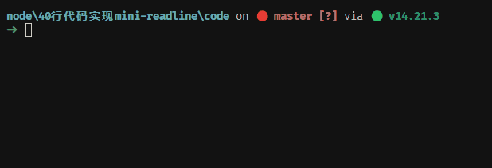
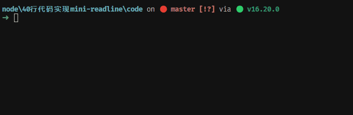

大家好，我是哈默。今天我们来实现一个简单的 `readline`，希望能帮助大家理解 readline 的核心原理。

## readline 的使用方法

readline 是 node 的一个内置模块。

它的使用方法是：

```js
const readline = require("readline");

const rl = readline.createInterface({
  input: process.stdin,
  output: process.stdout,
});

rl.question("如何鼓励一下哈默：", (answer) => {
  console.log(`你的选择是：${answer}`);

  rl.close();
});
```

效果：



接下来，我们就来自己用 40 行代码实现一个 mini-readline 吧。

## 功能

监听我们在命令行中输入的内容，将输入的内容获取到，并打印出来。

## 定义核心方法 emitKeypressEvents

首先，我们定义一个 `read方法`，这个方法接收一个回调函数，在回调函数里，我们可以接收到一个 `answer` 参数，这个 answer 就是我们 **在命令行里输入的内容**。

```js
function read() {}

read((answer) => {
  console.log("你输入了：" + answer);
});
```

`readline` 的核心逻辑里，会定义一个 `emitKeypressEvents` 方法，所以在我们的代码里，我们也定义一下这个方法，并执行它：

```js
function read() {
  emitKeypressEvents();
}

function emitKeypressEvents() {}
```

同时，我们在 `read` 方法中，将 `输入流`、`输出流`、`保存结果的变量`，都定义出来，并将输入流作为参数传入 `emitKeypressEvents`：

```js
function read() {
  // 输入流
  const input = process.stdin;
  // 输出流
  const output = process.stdout;
  // 保存结果的变量
  let line = "";

  emitKeypressEvents(input);
}

function emitKeypressEvents(stream) {}
```

在 `emitKeypressEvents` 里，我们要做 2 件事情：

1. 监听用户的输入。
2. 处理用户的输入。

## 监听用户输入

首先，我们先来监听用户的输入：

```js
function emitKeypressEvents(stream) {
  function onData(chunk) {
    console.log("输入的内容：", chunk.toString());
  }
  stream.on("data", onData);
}
```

这里的 stream，是我们传入的输入流，我们通过在输入流上监听 data 事件，便可以让进程 **处于等待用户输入的状态**。

并且，我们可以打印出，我们输入的内容。

## 处理用户的输入

能够获取到用户输入的内容之后，我们还需要处理用户的输入。

首先，我们需要定义一个方法，能够不断处理用户输入的内容，我们将它取名为 `emitKeys`。

这个函数比较特殊，是一个 generator function：

```js
function emitKeypressEvents(stream) {
  function onData(chunk) {
    console.log("输入的内容：", chunk.toString());
  }
  stream.on("data", onData);

  const g = emitKeys(stream);
  g.next();
}

function* emitKeys(stream) {
  // 开启一个死循环，不断处理用户输入的内容
  while (true) {
    // 输入的字符
    let character = yield;
    // 广播一个 keypress 事件，参数为输入的字符
    stream.emit("keypress", character);
  }
}
```

当我们执行 `g.next()` 的时候，emitKeys 函数会执行起来，并且只会执行到 `let character = yield;` 这一行，并停止执行。

直到下一次我们再调用 `g.next()` 的时候，才会 **继续执行** `let character = yield;` 后面的代码。这个后续代码的执行时机，大家在心里记一下，后面会涉及。

## 广播 keypress 事件

现在我们能够获取到用户的输入内容，并且也定义了不断处理用户输入的函数，那最后一步就是我们要在用户输入回车的时候，将输入的内容传入到我们使用时候的 read 函数的参数中。

那么，首先，我们就可以在 onData，也就是获取到用户输入的地方，从原来的 console.log 变成 g.next(chunk.toString())。

我们给 g.next() 传入的参数（即 `chunk.toString()`）是我们输入的内容，而这个参数会通过 emitKeys 里的 `yield` 关键字返回，保存到 character 变量中：

```js
let character = yield;
```

然后通过输入流广播一个 keypress 事件，参数为输入的内容。

那么此时，我们就需要有一个地方来监听这里广播的 keypress 事件。

## 监听 keypress 事件

我们可以将这个监听 keypress 事件的函数定义在 read 方法中。

```js
function read(callback) {
  // keypress 事件的回调
  function onkeypress(character) {}

  ...

  emitKeypressEvents(input);

  input.on("keypress", onkeypress); // 监听 keypress 事件
}
```

在 onkeypress 中，我们将会处理 keypress 事件，其中就包括：在用户输入 `回车键` 的时候，调用用户传入的回调函数，并结束整个进程。

这里我们要处理回车的事件，所以我们需要开启输入流的原始模式。

开启后，将终端对字符的所有特殊处理都将被禁用，比如 `回车、ctrl + c 结束进程、甚至包括我们输入字符时，字符的回显` 。

这些操作的行为，将完全让我们开发者自己来定义，输入将会逐个字符进行监听。

开启的方式也是比较简单的，我们只需要调用输入流的 `setRawMode` API 即可。

```js
function read(callback) {
  // keypress 事件的回调
  function onkeypress(character) {}

  ...

  emitKeypressEvents(input);

  input.on("keypress", onkeypress); // 监听 keypress 事件
  input.setRawMode(true);
}
```

此时，我们会发现，我们不能输入任何字符了！

所以，我们第一步，就先将输入的内容回显出来。

```js
function read(callback) {
  function onkeypress(character) {
    // 通过 line 变量，保存输入的内容
    line += character;
    // 向输出流写入我们输入的内容，让我们输入的内容能够回显出来
    output.write(character);
  }

  ...

  emitKeypressEvents(input);

  input.on("keypress", onkeypress); // 监听 keypress 事件
  input.setRawMode(true);
}
```

此时，我们又能输入字符了，但会发现回车键，ctrl + c 依旧无法使用。

那么，我们就继续对于回车键进行处理，即 `character` 为 \r 的时候，将用户输入的所有内容传入到用户给的回调函数中：

```js
function read(callback) {
  function onkeypress(character) {
    // 通过 line 变量，保存输入的内容
    line += character;
    // 向输出流写入我们输入的内容，让我们输入的内容能够回显出来
    output.write(character);

    switch (character) {
      // 当输入回车键的时候，我们调用用户传入的回调函数 callback
      case "\r":
        // 将输入的内容，传入到 callback 中
        callback(line);
        break;
    }
  }

  ...

  emitKeypressEvents(input);

  input.on("keypress", onkeypress);
  input.setRawMode(true);
}
```

此时，我们会发现，我们接近成功了！



我们可以看到我们的回调函数执行了，并得到了结果：

```js
// 我们给 read 函数的回调函数执行了，并得到了 answer 的结果
read((answer) => {
  console.log("你输入了：" + answer);
});
```

最后一个问题！我们的进程没有结束，所以最后我们需要将输入流中断下来，我们可以通过输入流的 `pause` API：

```js
function read(callback) {
  function onkeypress(character) {
    // 通过 line 变量，保存输入的内容
    line += character;
    // 向输出流写入我们输入的内容，让我们输入的内容能够回显出来
    output.write(character);

    switch (character) {
      // 当输入回车键的时候，我们调用用户传入的回调函数 callback
      case "\r":
        // 将输入的内容，传入到 callback 中
        callback(line);
        // 将输入流中断下来
        input.pause();
        break;
    }
  }

  ...

  emitKeypressEvents(input);

  input.on("keypress", onkeypress);
  input.setRawMode(true);
}
```

我们再来试一下：


可以看到，输入流中断后，进程也成功终止了。

至此，我们的 mini-readline 也就实现完了。

## 总结

我们实现了一个简单的 readline，mini-readline。

原理是比较简单的，就是：监听用户的输入，并处理用户的输入，最终调用用户传入的回调。

但其中的过程，如果初次接触的话，可能需要多看几遍，并自己亲自尝试一下，才能够 get 到其中的原理。
