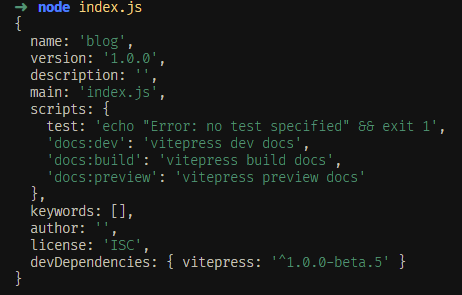

大家好，我是哈默。今天我们来简单说一下 require 支持加载哪些类型资源。

## 支持加载的资源类型

require 支持三种类型的文件加载：

1. .js
2. .json
3. .node

## .js 类型的文件

对于 .js 类型的文件，我们需要在文件内部通过 `module.exports` 或者 `exports.xxx` 的方式导出数据。

使用 module.exports:

```js
// index.js
const module1 = require("./module1.js");

console.log(module1.a);
console.log(module1.add(10, 20));

// ./module1.js
module.exports = {
  a: 10,
  add: function (num1, num2) {
    return num1 + num2;
  },
};
```

最终打印结果为：

```js
10;
30;
```

使用 exports.xxx:

```js
// index.js
const module1 = require("./module2.js");

console.log(module1.a);
console.log(module1.add(10, 20));

// ./module2.js
exports.a = 10;
exports.add = function (num1, num2) {
  return num1 + num2;
};
```

最终打印结果为：

```js
10;
30;
```

## .json 类型的文件

对于 .json 类型的文件，我们在 require 的时候，会对 json 文件里的数据进行 `JSON.parse()`

比如我们最常见的 package.json 文件：

```js
// package.json
{
  "name": "blog",
  "version": "1.0.0",
  "description": "",
  "main": "index.js",
  "scripts": {
    "test": "echo \"Error: no test specified\" && exit 1",
    "docs:dev": "vitepress dev docs",
    "docs:build": "vitepress build docs",
    "docs:preview": "vitepress preview docs"
  },
  "keywords": [],
  "author": "",
  "license": "ISC",
  "devDependencies": {
    "vitepress": "^1.0.0-beta.5"
  }
}
```

最终打印结果：



## .node 类型的文件

.node 类型的文件是 C++ 扩展程序。

因为 node 本身就是由 C++ 编写的，所以预留了编写 C++ 扩展程序的接口，不过这种类型的文件我们一般不会接触到。

## 任意文件

// any -> .js
