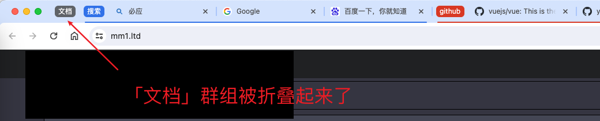

有时候，我们会在浏览器打开很多标签页，如下：

这时候，会看着很乱🤯，如何高效管理这些标签页呢？

## 思考
我们打开的这些标签页，通常来讲，是「**可以进行分类**」的，如下：

那么，浏览器有没有提供一个功能，能帮助我们 「**以组为单位**」，管理这些标签页呢？🧐

答案是有的。✅

## 具体操作来了！
我们可以使用浏览器的 **「群组」功能**。

- 创建新的群组

- 将另一个标签页添加到新的群组

然后，我们如法炮制，将剩下的标签页，都按照我们的分类，进行群组，就会得到如下的结果：

## 还有疑问...
此时，有的同学会说：

「ok，现在确实有 4 个群组了，每个群组也有不同的颜色，但是这些标签页还都是平铺的展开的来展示的呀，有没有一种方法能够折叠某个群组呢？」

好问题！

我们可以 **将暂时不会用到的群组进行折叠！**

只需要点击群组名字就可以了，如下：

【文档】群组被折叠起来了

那我们就可以按照我们的需要，按需折叠、展开各个群组：

## 总结

我们可以利用 chrome 浏览器的「群组」功能，帮助我们高效的管理各个标签页，让我们的浏览器变的干净亿点点~

本文仅介绍了群组功能里的基本功能，更多群组的功能就等大家一起来发现啦！
