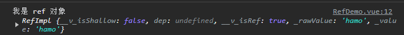

大家好，我是哈默。今天我们来说一下为什么在 `Vue3` 中我们需要 `ref`。

## reactive 的使用

我们知道，在使用 reactive 的时候，我们可以给 `reactive` 传入对象：

```vue
<script setup>
import { reactive } from "vue";

const info = reactive({
  name: "hamo",
  age: 20,
});
</script>
```

此时，运行正常。

## 给 reactive 传入原始类型的数据

但如果我们给 reactive 传入原始类型的数据：

```vue
<script setup>
import { reactive } from "vue";

const name = reactive("hamo");
</script>
```

这个时候，就会报错：

```js
⚠️ value cannot be made reactive: hamo
```

## 报错的原因

以上报错的原因是因为，`reactive` 内部是用 `Proxy` 实现的：


而 Proxy 的语法是这样子的：

```js
// obj 被代理对象
const obj = {
  name: "hamo",
  age: 20,
};

// proxyObj 代理对象
// obj 被代理对象
const proxyObj = new Proxy(obj, {
  set() {
    // 触发依赖
    console.log("触发了 set，设置了值");
  },
  get() {
    // 收集依赖
    console.log("触发了 get，读取了值");
  },
});
```

也就是说，我们在 `new Proxy` 的时候，第一个参数，obj，被代理对象，它只能够传引用类型，如果我们传原始类型，就会报错：


而我们的 `reactive` 它又是基于 Proxy 的，也就是说，`reactive` 的第一个参数，也只能传递 `引用类型`，无法处理 `原始类型`，所以就报错了。

## ref 可以接收原始类型

而 `ref` 的第一个参数，是可以接收 `原始类型` 的，因为 `ref` 并不是由 `Proxy` 实现的，它是一个 `RefImpl` 类的对象:


而这个 `RefImpl` 类，第一个参数，是可以接收原始类型的，也可以接收引用类型：

```js
class RefImpl<T> {
  private _value: T
  ...

  // value 可以是原始类型的，也可以是引用类型
  constructor(value: T, public readonly __v_isShallow: boolean) {
    this._rawValue = __v_isShallow ? value : toRaw(value)
    this._value = __v_isShallow ? value : toReactive(value)
  }

  get value() {
    ...
  }

  set value(newVal) {
    ...
  }
}
```

## 总结

因为我们存在需要定义 `原始类型的响应性数据` 的需求，所以我们就需要有 `ref` 这个东西，来处理 **原始类型数据** 的响应性。
