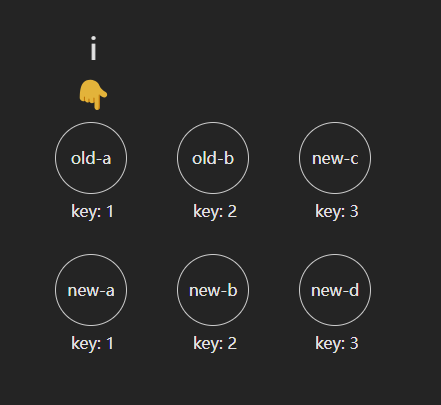
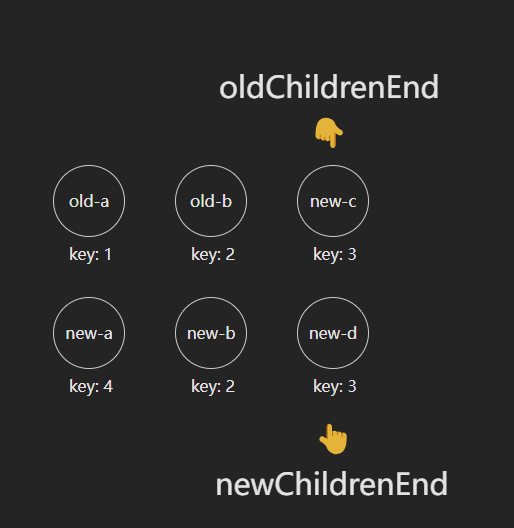
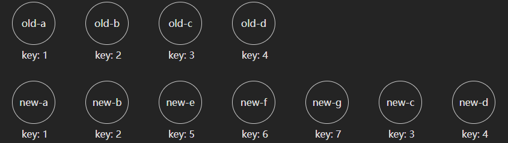
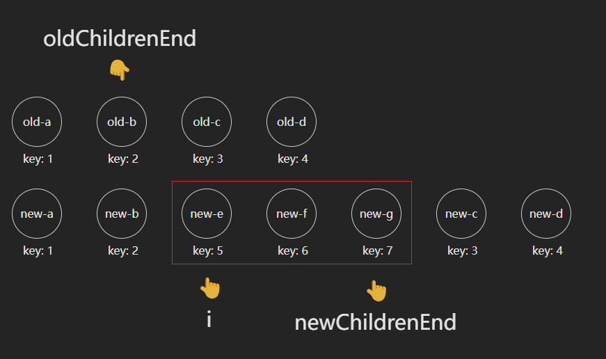
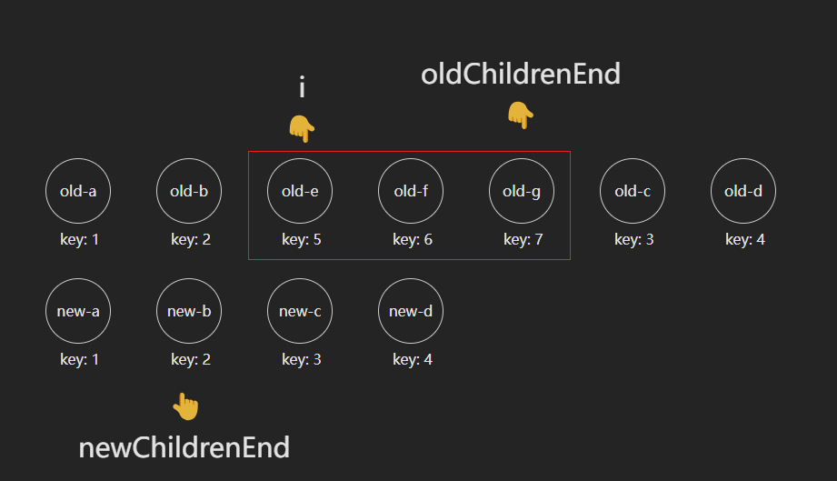
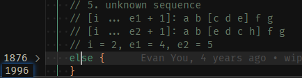

大家好，我是哈默。今天我们来继续来学习一下 `vue3` 中的 `diff算法`。上回，我们说到了[diff 算法要处理的几种场景](./2_diff算法要处理的几种场景.md)。在明确了 `diff` 算法要处理的几种场景之后，我们接下来再来看看 `vue3` 中是如何应用 `diff` 算法的呢？

## diff 算法的 5 大步

首先，我们来看下源码中，`diff` 算法的步骤分为哪些：

```js
// vue-next/packages/runtime-core/src/renderer.ts/patchKeyedChildren 中

const patchKeyedChildren = (
    oldChildren, // 旧的一组子节点
    newChildren, // 新的一组子节点
  ) => {
    let i = 0
    // 新的一组子节点的长度
    const newChildrenLength = newChildren.length
    // 旧的一组子节点中最大的 index
    let oldChildrenEnd = oldChildren.length - 1
    // 新的一组子节点中最大的 index
    let newChildrenEnd = newChildrenLength - 1

    // 1. 自前向后比对
    while (i <= e1 && i <= e2) {
      ...
    }

    // 2. 自后向前比对
    while (i <= e1 && i <= e2) {
      ...
    }

    // 3. 新节点多于旧节点，挂载多的新节点
    if (i > e1) {
      if (i <= e2) {
        ...
      }
    }

    // 4. 新节点少于旧节点，卸载多的旧节点
    else if (i > e2) {
      while (i <= e1) {
        ...
      }
    }

    // 5. 乱序
    else {
      ...
    }
  }
```

可以看到，`vue` 总共分为 5 步来进行 `diff` 算法，那么我们依次来看一下每一步都是怎么做的。

## 第一步：自前向后比对

这里我们简化了一下代码，并将变量名重新命名了一下，下同。

```js
let i = 0;

while (i <= oldChildrenEnd && i <= newChildrenEnd) {
  const oldVNode = oldChildren[i];
  const newVNode = newChildren[i];

  if (isSameVNodeType(oldVNode, newVNode)) {
    patch(oldVNode, newVNode);
  } else {
    break;
  }
  i++;
}
```

举例，**以下的所有元素都是 `li` 元素**：



第一步的话，`vue` 是先定义了一个指针 `i`，初始值为 `0`。

然后分别获取第 1 个旧节点，第 1 个新节点，并将它们扔到一个 `isSameVNodeType` 的函数中。

我们来看下这个 `isSameVNode` 函数：

```js
export function isSameVNodeType(n1: VNode, n2: VNode): boolean {
  return n1.type === n2.type && n1.key === n2.key;
}
```

这个函数就是在比较，两个节点的 `type` 和 `key` 是否相同，如果相同，就认为是同一个节点。

那么，对于我们目前的例子而言，第 1 个旧节点，第 1 个新节点，他们的 `type` 都是 `li`，`key` 都为 `1`，所以它们是相同的节点，直接 `patch` 更新就好。

更新完第一个节点后，`i++`，依旧满足 `while` 循环的条件，所以我们继续进入循环。

同理，会更新第二、三个节点，这样子，我们就处理完了所有的子节点了。

最后，我们来观察下，我们这个 `while` 循环什么时候会提前 `break` 掉呢？

```js
if (isSameVNodeType(oldVNode, newVNode)) {
  patch(oldVNode, newVNode);
} else {
  break;
}
```

可以发现，就是当 `isSameVNodeType` 返回 `false` 的时候，所以假如当我们碰到一对新、旧节点，它们不是相同的节点，那么这个循环就会提前 `break` 掉。

## 第二步：自后向前比对

在第 1 步自前向后的循环结束之后，就会来到第 2 步 —— 子后向前比对。

```js
// 旧的一组子节点中最大的 index
let oldChildrenEnd = oldChildren.length - 1;
// 新的一组子节点中最大的 index
let newChildrenEnd = newChildrenLength - 1;

while (i <= oldChildrenEnd && i <= newChildrenEnd) {
  const oldVNode = oldChildren[oldChildrenEnd];
  const newVNode = newChildren[newChildrenEnd];

  if (isSameVNodeType(oldVNode, newVNode)) {
    patch(oldVNode, newVNode, container, null);
  } else {
    break;
  }
  oldChildrenEnd--;
  newChildrenEnd--;
}
```

举例，**以下的所有元素都是 `li` 元素**，注意，`new-a` 的 `key` 和 `old-a` 的 `key` 不同：



根据我们上面所说的，首先还是会来到第一步，自前向后比对。

但是当比较第一个新、旧节点的时候，发现：key 不同，所以不是同一个节点，直接会 `break` 掉，然后就会进入到第二步 —— 自后向前比对。

`自后向前比对` 的步骤其实也是和 `自前向后比对` 的步骤很类似，也是如果是相同的节点，那么就 `patch` 更新，否则就 `break` 掉，只不过是倒叙的一个循环而已。

这样一来，所有的子节点也可以更新完毕。

## 第三步：新节点多于旧节点，挂载多的新节点

上面的例子中，我们的节点数量是相同的。但如果节点数量不同，那么就要涉及到 `挂载` 和 `卸载` 的操作了。

我们先来看下 `新节点多于旧节点` 的情况：



经过第一步、第二步之后，`i、oldChildrenEnd、newChildrenEnd` 的值如图：



可以看到，我们只需要挂载 `i` 到 `newChildrenEnd` 之间的新元素即可。

## 第四步：新节点少于旧节点，卸载多的旧节点

我们再看下 `新节点少于旧节点` 的情况：



可以看到，我们只需要卸载 `i` 到 `oldChildrenEnd` 之间的旧元素即可。

## 第五步：乱序

乱序的代码是比较多的，有 100 多行：



而且，其中还涉及到了 `最长递增子序列` 这样的新概念，所以我们下次再单独来讲它。

## 总结

这次，我们一共分析了 `vue3` 中 `diff算法` 的前 4 步：

1. 自前向后比对
2. 自后向前比对
3. 新节点多于旧节点
4. 新节点少于旧节点

通过这几步，我们已经能够处理一些基本的场景了。
