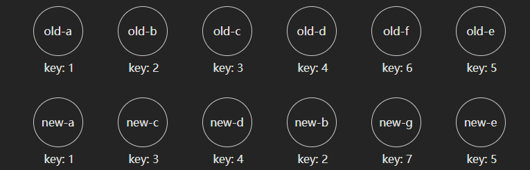
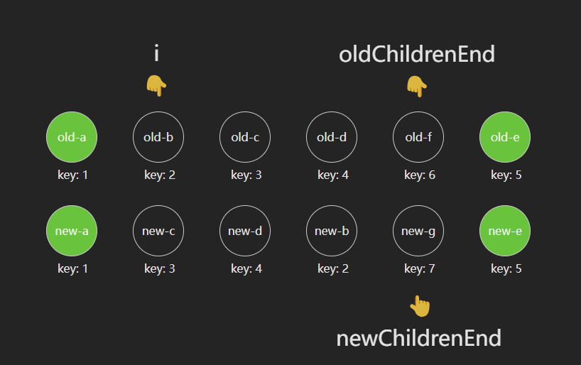
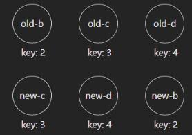
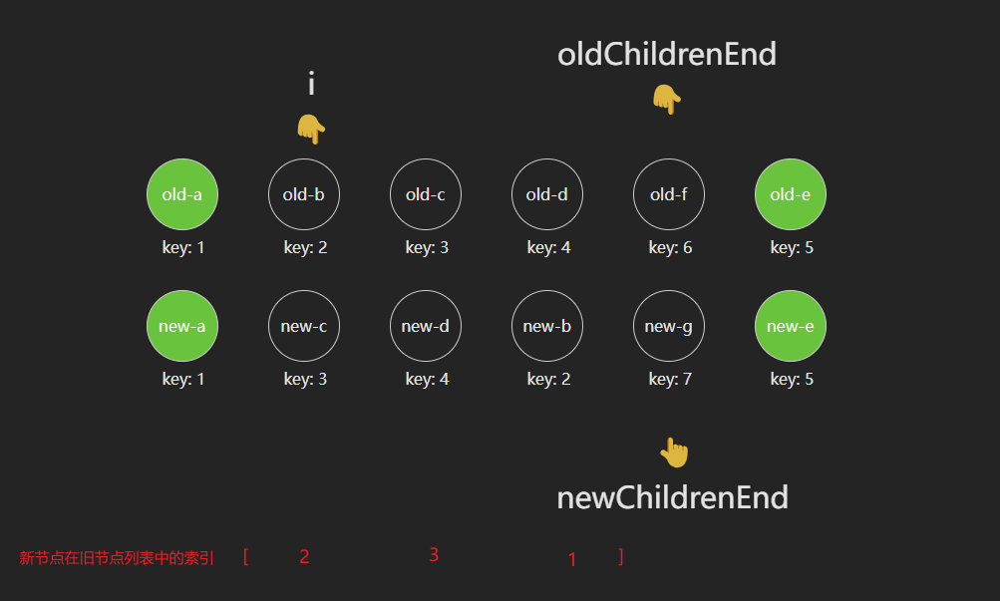

大家好，我是哈默。今天我们来继续来学习一下 `vue3` 中的 `diff算法`。上回，我们说到了 [diff 的前 4 步](./3_vue3中diff的前4步.md)。那么最后，我们还需要看一下 `乱序` 的情况 vue 是如何处理的。

## 举例

因为乱序的代码是比较多的，所以我们主要来说一下它的核心逻辑。

对于我们当前的例子而言，首先，我们经过第一步（自前向后比对）、第二步（子后向前比对）之后，结果如下：

对于第三步（挂载多的新节点）、第四步（卸载多的旧节点）而言，我们的新、旧节点数量是相同的，所以不需要做任何处理。

这样，我们就来到了第五步 —— 乱序。

## 乱序处理

对于乱序而言，它主要处理三种情况：

1. 删除旧节点 f
2. 挂载新节点 g
3. 对于节点 b-d 进行移动

## 删除旧节点

删除的逻辑是：如果旧节点的 `key` 在新节点列表中找不到了，那么我们就认为这个旧节点应该被删除，比如我们这里的节点 old-f，它的 `key` 是 6，在新节点列表中找不到 `key` 为 6 的元素，所以我们就将它删除。

但是，如果对于每个旧节点，我们都通过这个旧节点的 `key` 去新节点列表中查找，有时候是不必要的。

所以，`vue` 在这里做了一个优化，它在记录 2 个变量：已经修复的新节点数量 `patched` 和 新节点待修复的数量 `toBePatched`。

在每次修复完一个新节点后，都会 `patched++`，然后在执行我们上面的查找行为之前，会判断一下：`patched >= toBePatched？`，如果是 `true`，就代表着当前所有的新节点都已经处理完了，那么对于剩下的旧节点，我们不用再去查找，直接删除即可。

## 挂载新节点

挂载的逻辑就比较简单了：如果拿新节点的 key，没有找到对应的旧节点，比如我们这里的节点 new-g，它的 `key` 是 7，在旧节点列表中找不到 `key` 为 7 的元素，所以我们就将它挂载。

## 移动节点

现在，我们有 3 个节点需要移动：b、c、d。

那么，如何移动才能最高效呢？

我们通过肉眼可以知道：我们只需要将 b 移动到末尾就可以了！

但是，vue 该如何知道呢？

这里，我们就需要介绍一个 `最长递增子序列` 的概念。

## 最长递增子序列

假如我们有:

旧数组：[1, 2, 3, 4, 5, 6]

新数组：[1, 3, 2, 4, 6, 5]

对于新数组而言，我们如果想找到 `递增子序列` 的话，可以找到很多：

1. `1, 3, 6`
2. `1, 2, 4, 5`

...

确认这个递增子序列的目的，就是为了在由旧数组变成新数组的时候，递增子序列里的这些元素可以不用移动。

比如，对于 `1, 3, 6` 而言，我们可以不需要移动它们，只需要移动剩下的 `2, 4, 5` 到对应的位置即可，总共需要 3 次移动。

对于 `1, 2, 4, 5` 而言，我们可以不需要移动它们，只需要移动剩下的 `3, 6` 到对应的位置即可，总共需要 2 次移动。

显而易见的是，当我们的递增子序列越长，我们所需要的移动次数就越少。

所以，我们求解最长递增子序列的目的就是：减少移动次数，进行更高效地移动。

## 对于我们目前的例子

对于我们现在而言，我们的数组里的元素是：新节点在旧节点列表里的索引。

比如，我们的 `new-c`，它在旧节点中的索引是 2，同理，`new-d` 是 3，`new-b` 是 1。

所以，我们可以得到一个数组：`[2, 3, 1]`。

对于这个数组而言，最长递增子序列为：`[2, 3]`，也就是 `c` 和 `d` 不需要移动，只需要移动 `b` 即可。

这样一来，我们就通过 `最长递增子序列` 完成了最高效的移动操作。

## 总结

至此，我们完成了乱序的处理。

其中，涉及到了一个新的概念，最长递增子序列，它其实只是用来处理移动的场景，让我们的移动能够高效的进行。
