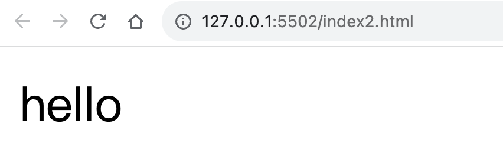
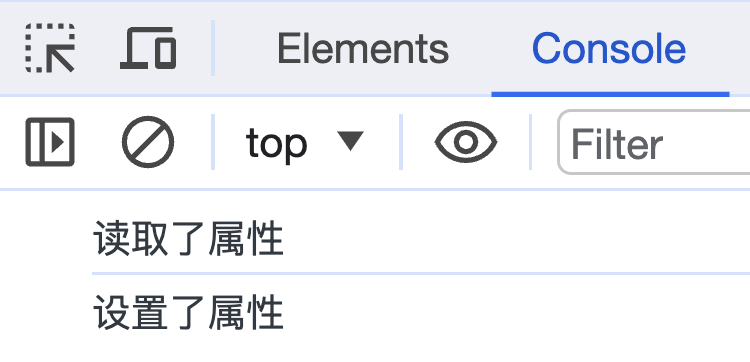
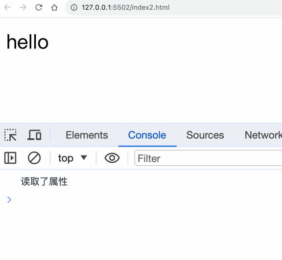
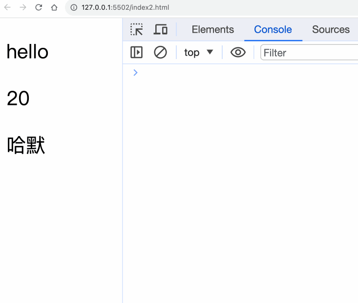
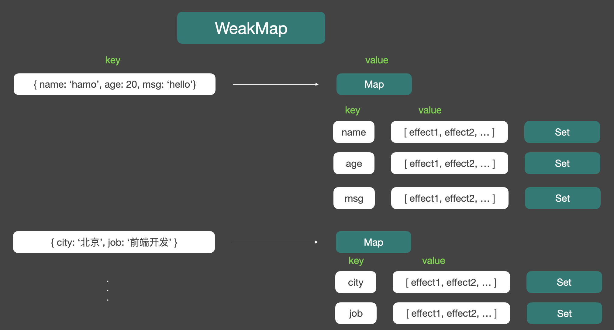

大家好，我是哈默。今天我们来学习一下 vue3 中的 `响应性原理`。

## 响应性数据和副作用函数

现在，假如我有一个响应性的数据：

```js
const data = {
  name: "哈默",
  age: 20,
  msg: "hello",
};
```

页面上有一处 `div#app` 的容器：

```js
<div id="app"></div>
```

那我们可以通过一个副作用函数 `effect` 将响应性数据里面的 `msg` 渲染到 `div#app` 中。

```js
function effect() {
  document.getElementById("app").innerText = obj.msg;
}
```

这个时候，我们执行 effect 函数：

```js
effect();
```

页面上就可以成功的渲染出来我们的 obj.msg 的值 hello。


那么，现在我们的目标是：

> 在数据发生改变时，重新渲染视图。

而我们知道，vue3 中是使用 `Proxy` 来监听数据的读取和设置操作的，所以我们可以将 `data` 进行改造：

```js
const data = {
  name: "哈默",
  age: 20,
  msg: "hello",
};

const obj = new Proxy(data, {
  get(target, key) {
    console.log("读取了属性");
    return data[key];
  },
  set(target, key, value) {
    console.log("设置了属性");
    target[key] = value;

    return true;
  },
});
```

这个时候，我们就可以使用代理对象 `obj` 来访问被代理对象 `data` 里的属性或者设置属性：

```js
obj.msg;
obj.msg = "bye";
```

控制台中，就会打印出我们读取和设置的行为：



现在，我们想要在设置响应性数据的时候，重新渲染视图。

比如将 obj.msg 从 hello 变成了 bye，我们希望页面上也能从 hello 变成 bye。

那么，我们只需要重新执行 effect 就可以了：

```js
function effect() {
  document.getElementById("app").innerText = obj.msg;
}
```

effect 就会把我们目前 obj.msg 的值渲染到对应的 div#app 中。

问题是：我们如何能够在 obj.msg 的值发生改变的时候，重新执行 effect 呢？

我们在设置 obj.msg 的时候，会触发 set 行为：

```js
set(target, key, value) {
  console.log("设置了属性");
  target[key] = value;

  // TODO: 重新执行 effect

  return true;
}
```

所以我们只要在 set 行为里重新执行 effect 就好了。

因为我们在第一次将 obj.msg 渲染到页面上的时候，需要获取 obj.msg 的值，才能知道要渲染什么内容到页面上。

那么，在获取 obj.msg 的时候，也就是 get 行为的时候，我们就可以将 effect 存在一个容器里面。

然后我们就可以在设置 obj.msg 的时候，也就是 set 行为时，将容器里的 effect 依次执行。

```diff
+ const fns = new Set()

const obj = new Proxy(data, {
  get(target, key) {
    console.log("读取了属性");
+   fns.add(effect)
    return data[key];
  },
  set(target, key, value) {
    console.log("设置了属性");
    target[key] = value;

+   fns.forEach(fn => fn())

    return true;
  },
});
```

来看下效果：


现在，我们就完成了一个最基本的响应性的实现。

但是，现在我们有 2 个问题：

1. effect 执行的逻辑是硬编码的。
2. 无论我们修改 obj 的什么属性，都会重新执行 effect。

## 问题 1

我们现在的 effect 只能做一件事情：

```js
function effect() {
  document.getElementById("app").innerText = obj.msg;
}
```

所以，我们需要将其改造一下：

```diff
+ let activeEffect;

- function effect() {
-   document.getElementById("app").innerText = obj.msg;
- }
+ function effect(fn) {
+  activeEffect = fn;
+  fn();
+ }

const obj = new Proxy(data, {
  get(target, key) {
-   fns.add(effect)
+   fns.add(activeEffect);
    return data[key];
  },
  set(target, key, value) {
    target[key] = value;

    fns.forEach((fn) => fn());

    return true;
  },
});
```

我们让 effect 接受一个参数 `fn`，这样我们就可以执行多个副作用函数。

```js
effect(fn1); // fn1 会更新页面上 p1 元素
effect(fn2); // fn2 会更新页面上 p2 元素
```

## 问题 2

我们先来看一下目前修改一个属性的时候，所有 effect 都会执行的现象。

代码：

```diff
const data = {
  name: "哈默",
  age: 20,
  msg: "hello",
};

let activeEffect;

function effect(fn) {
  activeEffect = fn;

  fn();
}

const fns = new Set();

const obj = new Proxy(data, {
  get(target, key) {
    console.log("读取了属性");
    fns.add(activeEffect);
    return data[key];
  },
  set(target, key, value) {
    console.log("设置了属性");
    target[key] = value;
    fns.forEach((fn) => fn());

    return true;
  },
});

+ effect(() => {
+   console.log("根据 msg 属性的值，渲染 p1 的内容");
+   document.getElementById("p1").innerText = obj.msg;
+ });
+ effect(() => {
+   console.log("根据 age 属性的值，渲染 p2 的内容");
+   document.getElementById("p2").innerText = obj.age;
+ });
+ effect(() => {
+   console.log("根据 name 属性的值，渲染 p3 的内容");
+   document.getElementById("p3").innerText = obj.name;
+ });

setTimeout(() => {
  obj.msg = "bye";
}, 5000);
```

我们改变 obj.msg 的值，从 hello 改成 bye，在页面上：



我们发现，除了出发了 msg 的重新渲染，age、name 相应的区域也发生了重新渲染。

所以我们需要建立起 effect 和某个对象某个属性之间的联系。

在 vue 中，最后是这样做的：



这样一来，我们的某一个 effect 就可以被放到某一个对象的某一个属性的一个 Set 数组中了。

当我们改变某一个响应性对象的属性，比如 msg 的时候，我们就只需要找到 msg 对应的那个 Set 数组，然后循环执行就可以了。

到这里，我们的响应性系统又进一步完善了一下。

## 总结

整个响应性的原理就是围绕着 `Proxy` 和 `effect` 来进行的，我们只需要能够在响应性数据发生变化的时候，正确地执行对应的 effect ，就可以实现一个响应性了。
