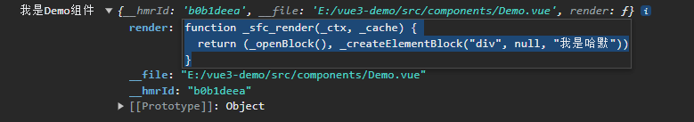
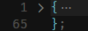

大家好，我是哈默。今天我们来学习一下 vue3 中是如何去编译我们写在 `template` 中的模板的。

## Vue 编译器的目标

我们首先来宏观地看一下 Vue 编译的流程。

首先，Vue 编译器的输入是很明确的，就是我们写在 `<template></template>` 中的模板，例如:

```js
<template>
  <div>我是哈默</div>
</template>
```

那么输出是什么呢？

我们可以定义一个 Demo 组件来看下：

Demo 组件：

```vue
<template>
  <div>我是哈默</div>
</template>
```

在 App 组件中引入 Demo 组件，然后打印 import 进来的 Demo 变量：

```vue
<template>
  <div>
    <Demo />
  </div>
</template>

<script setup>
import Demo from "./components/Demo.vue";
console.log("我是Demo组件", Demo);
</script>
```

打印结果：



可以看到，最终，我们的组件就是一个对象，里面包含了一个 render 函数，这个 render 函数里的内容，就是我们写在 template 中的内容。

所以，Vue 编译器的作用，就是把组件的 template 模板，编译成 render 函数，最后通过 render 函数来渲染组件。

## 编译的流程

明确了编译的目标之后，我们再来看下编译的流程是怎么样的。

整个 Vue 编译的流程主要分成 3 步：

1. 根据 template，生成 AST 抽象语法树
2. 将 AST 转化为 JavaScript AST
3. 根据 JavaScript AST 生成 render 函数

## 第一步：根据 template，生成 AST

在 Vue 源码中，它是通过 `parse` 方法来解析我们的模板的：

```js
const ast = parse(template);
```

假如我们有这样的一个模板：

```js
<div>我是哈默</div>
```

生成的 AST，有 60 多行：



可以看出：

1. AST 就是个对象
2. AST 里面包含了很多的属性来描述我们的模板

所以，我们可以对生成的 AST 进行简化：

```js
const ast = {
  type: 0, // 根节点
  children: [
    {
      type: 1, // DOM 节点
      tag: "div",
      tagType: 0,
      props: [],
      children: [
        {
          type: 2, // 文本节点
          content: "我是哈默",
        },
      ],
    },
  ],
};
```

可以看到，这里通过了一些属性，描述了我们模板的信息。

## 第二步：将 AST 转化为 JavaScript AST

有了 AST 之后，我们还不能直接生成 render 函数，还需要将 AST 转化成为 JavaScript AST 才行。

那么，JavaScript AST 和 AST 有什么不同呢？

首先 Vue 内部会通过一个 transform 方法来进行 AST -> JavaScript AST 的转化：

```js
transform(
  ast,
  extend({}, options, {
    prefixIdentifiers,
    nodeTransforms: [
      ...nodeTransforms,
      ...(options.nodeTransforms || []), // user transforms
    ],
    directiveTransforms: extend(
      {},
      directiveTransforms,
      options.directiveTransforms || {} // user transforms
    ),
  })
);
```

然后我们再来看一下实际情况，还是我们上面的模板：

```js
<div>我是哈默</div>
```

生成的 JavaScript AST，用绿色的 + 表示比 AST 多出的部分：

```diff
const ast = {
  type: 0,
  children: [
    {
      type: 1,
      tag: "div",
      tagType: 0,
      props: [],
      children: [
        {
          type: 2,
          content: "我是哈默",
        },
      ],
+     codegenNode: {
+       type: 13,
+       tag: '"div"',
+       children: {
+         type: 2,
+         content: "我是哈默",
+       },
+       isBlock: true,
+       disableTracking: false,
+       isComponent: false,
+     },
    },
  ],
+ codegenNode: {
+   type: 13,
+   tag: '"div"',
+   children: {
+     type: 2,
+     content: "我是哈默",
+   },
+   isBlock: true,
+   disableTracking: false,
+   isComponent: false,
+ },
};
```

我们的 JavaScript AST 会比 AST 多出一块 `codegenNode` 属性，这个属性是 `代码生成节点`，在生成 render 函数的时候，我们就会用到这个属性的值。

所以，我们这里面转化成 JavaScript AST 最重要的目的，就是为了得到这个 `codegenNode`。

## 根据 JavaScript AST 生成 render 函数

有了 JavaScript AST 以后，我们就可以通过一个 `generate` 函数来生成 render 函数了！

Vue 源码中：

```js
const renderFn = generate(
  ast,
  extend({}, options, {
    prefixIdentifiers,
  })
);
```

generate 函数：

```js
export function generate(ast, options) {
  ...

  const context = {
    code: '', // 生成的 render 函数，用字符串表示了出来
    push(code) {
      cotext.code += code // 使用字符串拼接的形式，拼接出了最终的 render 函数
    }
  }

  if (ast.codegenNode) {
    // genNode 里会使用 context.push 拼接 render 函数
    genNode(ast.codegenNode, context);  // <- 使用了 codegenNode
  } else {
    push(`null`);
  }

  ...

  return {
    code: context.code, // 生成的 render 函数，用字符串表示了出来
  };
}
```

可以看到：

1. 在 generate 函数中使用了我们第二步中生成的 `codegenNode`。
2. 我们的 render 函数其实就是个字符串，通过 context 的 push 方法拼接了出来，最终这个字符串会通过 `new Function` 转化成一个 render 函数。

最终，我们的 render 函数是长成这样：

```js
import {
  openBlock as _openBlock,
  createElementBlock as _createElementBlock,
} from "vue";

export function render(_ctx, _cache, $props, $setup, $data, $options) {
  return _openBlock(), _createElementBlock("div", null, "我是哈默");
}
```

## 总结

Vue 的编译过程主要就分成了三步，通过这三步，我们的模板就能转化成 render 函数，最终 Vue 会调用 render 函数，完成模板的渲染。
