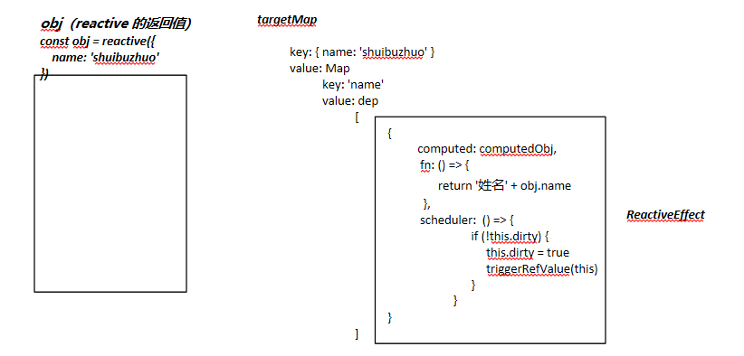
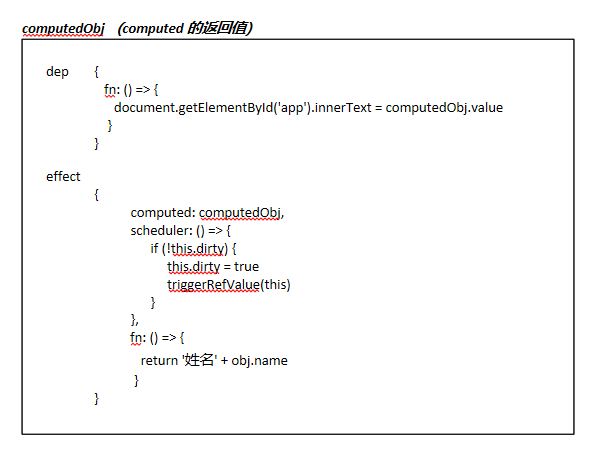

# computed 的响应性

## 代码

```js
const { reactive, effect, computed } = Vue;

const obj = reactive({
  name: "shuibuzhuo",
});

const computedObj = computed(() => {
  return "姓名" + obj.name;
});

effect(() => {
  document.getElementById("app").innerText = computedObj.value;
});

setTimeout(() => {
  obj.name = "zhangsan";
}, 2000);
```

## 特点

> 计算属性 `computed` 会 **基于其响应式依赖被缓存**，并且在依赖的响应式数据发生变化时 **重新计算**

## 步骤

1. 使用 `reactive` 创建响应式数据
2. 通过 `computed` 创建计算属性 `computedObj`，并且触发了 `obj` 的 `getter`
3. 通过 `effect` 方法创建了 `fn` 函数
4. 在 `fn` 函数中，触发了 `computed` 的 `getter`
5. 延迟触发了 `obj` 的 `setter`

## computed

1. 定义变量 `getter` 为我们给 `computed` 传入的回调函数，这个 getter 会传入 `ComputedRefImpl` 类的构造函数中，作为第一个参数
2. 生成 `ComputedRefImpl` 的实例，作为 `computed` 函数的返回值
3. `ComputedRefImpl` 内部，利用了 `ReactiveEffect` 函数生成了 `effect`，挂载到 `ComputedRefImpl` 的实例的 `effect` 属性上，这个 `effect` 的 `fn` 是 `getter`，也就是我们传给 `computed` 的回调函数

## computed 的 get value

当我们执行完 `computed` 函数后，我们会执行 `effect` 函数，在 `effect` 函数中，我们会触发 `computed` 的 `getter`：`computedObj.value`

1. `ComputedRefImpl` 实例本身没有 **代理监听**，它本质上是一个 `get value` 和 `set value` 的触发
2. 在每一次 `get value` 触发的时候，都会猪都触发一次 **依赖收集**，即执行 `trackRefValue`
3. 根据 `ComputedRefImpl实例` 的 `_dirty` 和 `_cacheable` 的值，判断是否需要触发 `effect` 的 `run`，也就是我们传给 `computed` 的回调函数
4. `computed` 的返回值，就是 `run` 函数执行之后的返回值，也就是我们传给 `computed` 的回调函数的返回值

## ReactiveEffect 的 scheduler

我们知道，当响应性数据触发 `setter` 的时候，计算属性需要触发依赖，重新计算。

那么，我们在哪里可以让计算属性触发依赖呢？

我们在 `ComputedRefImpl` 的构造函数中，创建了 `ReactiveEffect`，创建这个 `ReactiveEffect` 时，传入了第二个参数

```js
this.effect = new ReactiveEffect(getter, () => {
  if (!this._dirty) {
    this._dirty = true;
    triggerRefValue(this);
  }
});
```

这里的第二参数，匿名函数，里面的逻辑中，会判断当前这个 `ComputedRefImpl` 的 `_dirty` 属性，即 **脏** 的状态，如果是 false，则会 `triggerRefValue`，触发依赖，重新计算。

另外，triggerEffect 函数会对当前 `effect` 是否有 `scheduler` 属性，进行判断，有的话，就会执行 `scheduler` 函数。

```js
if (effect.scheduler) {
  effect.scheduler();
} else {
  effect.run();
}
```

总结：

1. 我们首先设置了 `obj.name = 'zhangsan'`，改变了 `computedObj` 的依赖 `obj` 的 `name` 属性，此时，`computedObj` 应该重新计算。
2. 触发了 `obj` 这个 `proxy` 的 `setter`
3. 执行 `trigger`，**第一次触发依赖**
4. **注意**，此时触发的 effect，有 `computed` 属性，并且包含 `scheduler` 调度器属性，所以会触发调度器。
5. 调度器指向 `ComputedRefImpl` 的构造函数中创建 `ReactiveEffect` 时，传入的第 2 个参数，匿名函数，这个匿名函数中，会 `triggerRefValue`，触发 `computedObj` 的依赖，即**再次触发依赖**。
6. **总共触发 2 次依赖**
7. 最终会执行：

```js
() => {
  return "姓名" + obj.name;
};
```

这个返回值，作为 computedObj 的值，然后把这个值渲染到页面上

**obj（reactive 的返回值）**


**computedObj 实例（computed 的返回值）**

