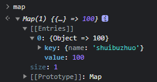
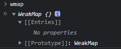

# 什么是 WeakMap？它和 Map 有何区别？

## 共同点

`WeakMap` 和 `Map` 都是 {key, value} 的结构对象

## 不同点

对于 `WeakMap` 而言，它存在 2 个不同点：

1. `key` 必须是对象
2. `key` 是弱引用的

## 弱引用和强引用

> 概念
>
> 弱引用：不会影响垃圾回收机制。即：WeakMap 的 key 如果 **不再存在任何引用** 时，会被直接回收。
>
> 强引用：会影响垃圾回收机制。存在强引用的对象永远 **不会** 被回收。

## 强引用

代码

```js
let obj = {
  name: "shuibuzhuo",
};

const map = new Map();

map.set(obj, 100);

obj = null;
```

结果


虽然 `obj` 已经不存在任何引用了，但是它并没有被回收，因为 `Map` 时强引用的。

## 弱引用

代码

```js
let obj2 = {
  name: "shuibuzhuo2",
};

const wmap = new WeakMap();

wmap.set(obj2, 100);

obj2 = null;
```

结果


当 `obj` 不存在其他引用时，`WeakMap` 不会阻止垃圾回收，基于 `obj` 的引用将会被清除，所以 `wmap` 里不存在任何值了，即 `WeakMap` 是弱引用的。

## 总结

`WeakMap` 的两个重要特性：

1. `key` 必须是对象
2. `key` 是弱引用的

<br>

在 `vue` 中的作用：

```js
const existingProxy = proxyMap.get(target);

if (existingProxy) {
  return existingProxy;
}

const proxy = new Proxy(target, baseHandlers);

proxyMap.set(target, proxy);
```

这里的 `proxyMap` 是一个 WeakMap，因为如果 `target` 不存在了，那么 `proxyMap` 里的这条键值对也就没有存在的意义了
