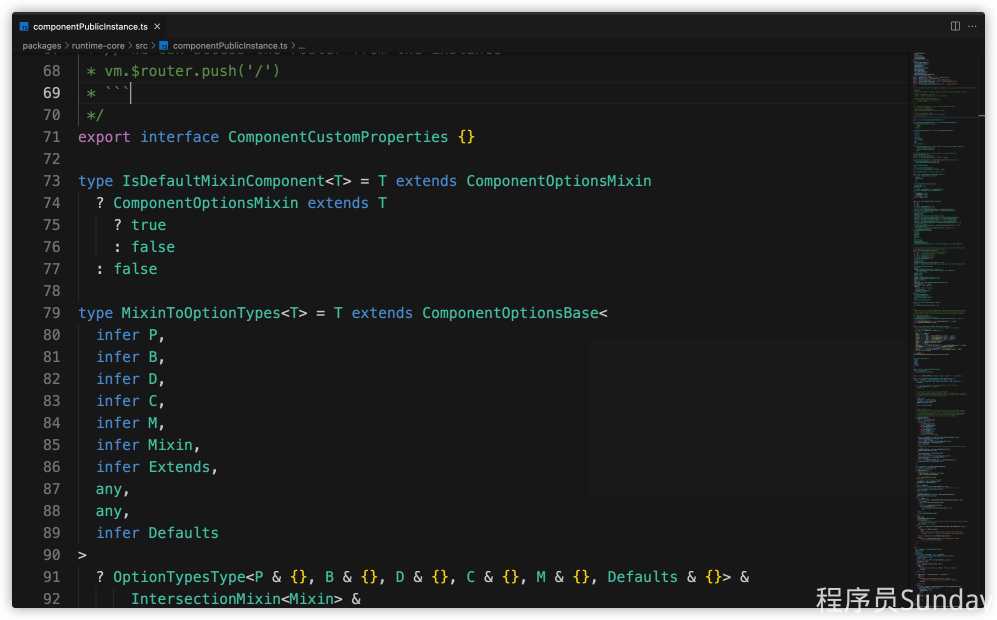

# 良好的 ts 支持，是如何提供的

`vue3` 对 `ts` 支持比较好，不是因为 `vue3` 是 `ts` 编写的，而是需要在 `vue3` 的源码里做很多类型相关的各种事情的。

## 举例

以下代码是 ts 编写的

```ts
function sum(n1: any, n2: any) {
  return n1 + n2;
}

sum("10", "20"); // 没有报错
```

我们期望 sum 接收的参数 n1 和 n2 是 number 类型，但现在我们传入 string 类型，也并没有报错， 即 ts 的支持不好。

## 改造

所以我们要明确定义 sum 函数接受的参数的类型

```ts
function sum(n1: number, n2: number) {
  return n1 + n2;
}

sum("10", "20"); // 此时报错，string 类型不能赋值给 number 类型
```

这个时候，我们再次传入 string 类型的参数，ts 编译的时候就会报错了，这个时候 ts 支持是友好的。

## 总结

所以，我们的代码用 `ts` 编写，并不代表 `ts` 支持就是友好的，我们需要做很多其他的工作。

比如 vue 源码里的这段代码，就是为了让 `ts` 支持更加友好，而不涉及到业务逻辑。


