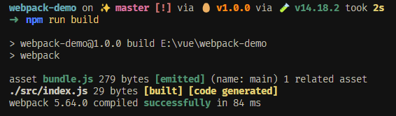
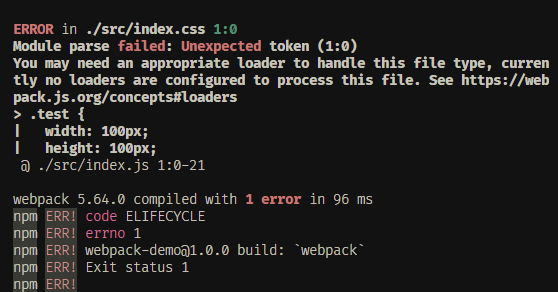
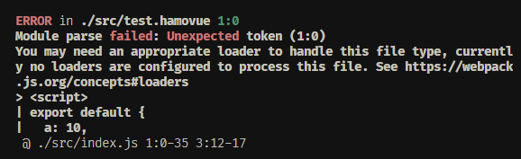

大家好，我是哈默。今天我们来自己写一个简单的 webpack loader。

## 什么时候需要使用 loader

当我们需要将除了 js 以外的资源转化为 js 的时候，我们就需要使用 loader。

## 引入 css

当我们在入口文件 index.js 中，编写了如下代码时：

```js
// index.js
console.log("hello 哈默");
```

npm run build 打包，打包成功：



但是当我们引入 非 js 文件的时候，比如我们引入一个 index.css：

```js
// index.js
import "./index.css";

console.log("hello 哈默");
```

此时，npm run build，打包就会报错：



因为 webpack 默认无法处理 非 js 文件，它提示我们需要使用合适的 loader 来处理 css 文件。

此时，我们可以配置 css-loader 和 style-loader 来解析 css 文件。

```js
// webpack.config.js
module.exports = {
  ...
  module: {
    rules: [
      {
        test: /\.css$/,
        use: ['style-loader', 'css-loader'],
      }
    ],
  },
};

```

此时，打包成功。

## 自定义 loader

那么现在我们就可以自己来定义一个 loader，来处理我们自己的文件类型，比如我们有一个 `.hamovue` 类型的文件。

```js
// test.hamovue
<script>
export default {
  a: 10,
  b: 20
}
</script>
```

我们模拟 vue 文件的写法，在里面导出了一个对象。

然后在 index.js 中将 test.hamovue 引入：

```js
import value from "./test.hamovue";

console.log(value);
```

这个时候，我们打包明显会失败：



我们需要自定义一个 loader 来处理 .hamovue 结尾的文件：

```js
const REG = /<script>([\s\S+]+?)<\/script>/;

module.exports = function (source) {
  const __source = source.match(REG);
  return __source && __source[1] ? __source[1] : source;
};
```

这里我们的入参 `source` 的值为：

```js
<script>
export default {
  a: 10,
  b: 20
}
</script>
```

最后整个匿名函数的返回值为：

```js
export default {
  a: 10,
  b: 20,
};
```

也就是说，我们将 `<script></script>` 标签之间的内容，给解析了出来。

最后一步，就是在 webpack.config.js 中，配置在碰到 .hamovue 结尾的文件时，使用我们的这个自定义 loader：

```js
module: {
  rules: [
    ...,
    {
      test: /\.hamovue$/,
      use: [path.resolve(__dirname, './loader/hamo-loader.js')],
    },
  ],
}
```

这样一来，当我们引用 test.hamovue 的时候，就能够得到导出的对象。

```js
import value from "./test.hamovue";

console.log(value); // { a: 10, b: 20 }
```

## 总结

在 webpack 中，loader 其实就是一个函数，我们在函数中处理某种类型文件中的代码内容，然后返回处理之后的结果，并且在 webpack 配置文件中使用该 loader 处理这种类型的文件即可。
