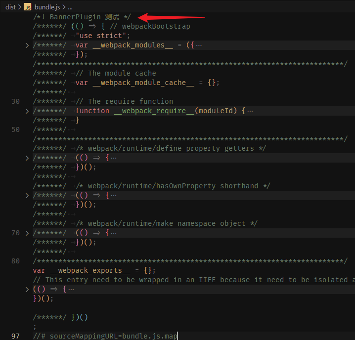
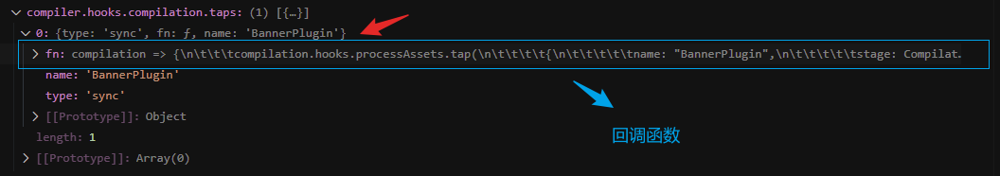
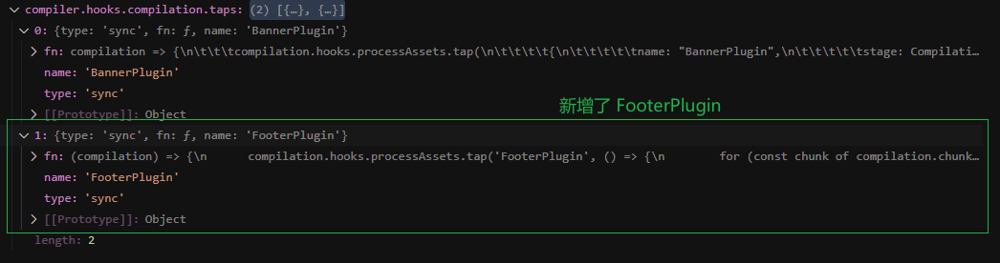
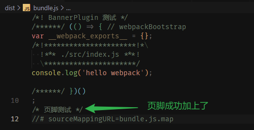

大家好，我是哈默。今天我们来自己写一个简单的 webpack plugin。

## 什么时候需要使用 plugin

当我们想要在 webpack 构建的整个生命周期的某一个生命周期钩子中，想要去实现某种功能的时候，就可以使用 plugin。

就像我们在 Vue 中的生命周期 created，mounted 里实现某些功能一样。

## webpack 内置的 plugin

webpack 默认就提供了很多 plugin 供我们使用，比如 BannerPlugin，它是用来在我们构建出来的 js 文件的开头添加注释的。

webpack.config.js 中：

```js
plugins: [
  new webpack.BannerPlugin({
    banner: "BannerPlugin 测试",
  }),
];
```

打包后的 bundle.js 中，可以看到开头加了一句 `BannerPlugin 测试`：



我们看下 BannerPlugin 的内部实现：

```js
// node_modules/webpack/lib/BannerPlugin.js

// 生成注释
const wrapComment = (str) => {
  if (!str.includes("\n")) {
    return Template.toComment(str);
  }
  return `/*!\n * ${str
    .replace(/\*\//g, "* /")
    .split("\n")
    .join("\n * ")
    .replace(/\s+\n/g, "\n")
    .trimRight()}\n */`;
};

class BannerPlugin {
  constructor(options) {
    // 处理 options
    this.banner = () => wrapComment(options.banner);
  }

  // 每个 webpack 插件都会实现一个 apply 方法
  // webpack 会在遍历所有插件的时候，执行插件的 apply 方法
  apply(compiler) {
    const banner = this.banner;

    // 在 compilation 编译对象创建之后的钩子里，给 BannerPlugin 注册回调函数
    compiler.hooks.compilation.tap("BannerPlugin", (compilation) => {
      // 在 processAssets 处理资源的钩子里，给 BannerPlugin 注册回调函数
      compilation.hooks.processAssets.tap("BannerPlugin", () => {
        for (const chunk of compilation.chunks) {
          for (const file of chunk.files) {
            const data = {
              chunk,
              filename: file,
            };

            // 生成注释
            const comment = compilation.getPath(banner, data);

            // 更新资源的源码
            compilation.updateAsset(
              file,
              (old) => new ConcatSource(comment, "\n", old) // 先拼接注释，再加上换行，最后拼接旧源码
            );
          }
        }
      });
    });
  }
}
```

可以看到，主要就做了以下几件事情：

- 首先处理了传入的 options。

对应到我们这里，options 就是：

```js
{
  banner: "BannerPlugin 测试",
}
```

- 实现了一个 apply 方法，webpack 会在遍历所有插件的时候，执行插件的 apply 方法。

在调用 apply 方法的时候，webpack 会将 compiler 实例传入，然后我们就可以在 compiler 的 compilation 的 hook 中注册一个回调函数，
这个 compilation 的 hook 的执行时机是在 **编译对象创建之后** 会进行执行。

通过调试 webpack 源码，可以看到我们的回调函数被加入到了 `compiler.hooks.compilation.taps` 这个数组中：



当执行到 compilation 这个 hook 的时候，就会遍历地去执行数组里面的每一项的 fn。

我们在这里是在 compilation 的 hook 里又注册了一个钩子 processAssets：

```js
compiler.hooks.compilation.tap("BannerPlugin", (compilation) => {
  // 在 processAssets 处理资源的钩子里，给 BannerPlugin 注册回调函数
  compilation.hooks.processAssets.tap("BannerPlugin", () => {
    // do something...
  });
});
```

这回是注册在 compilation hook 的回调函数的参数 compilation 的 processAssets 这个 hook 上的，也就是会在 **处理资源** 的时候进行回调。

在这个 processAssets 回调里做的事情就是生成注释，然后用这个注释，对资源的源码进行更新。

对应到我们这里，注释就是我们通过参数传入的 `BannerPlugin 测试`，资源就是打包生成的 `bundle.js` 了。

## 自己实现一个 plugin

明确了原理之后，我们自己实现一个插件也就很容易了，我们来实现一个插件 FooterPlugin，它的功能也非常简单：**在源码的最后加上注释**。

这里我们可以完全借鉴 BannerPlugin，并简化里面的实现即可，直接贴出代码：

```js
// FooterPlugin.js
const { ConcatSource } = require("webpack-sources");

class FooterPlugin {
  constructor(options) {
    // 接收实例化时传入的配置
    this.options = options;
  }

  // 每个 webpack 插件都会实现一个 apply 方法
  // webpack 会在遍历所有插件的时候，执行插件的 apply 方法
  apply(compiler) {
    // 在 compilation 编译对象创建之后的钩子里，给 FooterPlugin 注册回调函数
    compiler.hooks.compilation.tap("FooterPlugin", (compilation) => {
      // 在 processAssets 处理资源的钩子里，给 FooterPlugin 注册回调函数
      compilation.hooks.processAssets.tap("FooterPlugin", () => {
        for (const chunk of compilation.chunks) {
          for (const file of chunk.files) {
            // 这里简化一下，直接使用传入的参数作为注释的内容，被加上注释的符号即可
            const comment = `/* ${this.options.banner} */`;

            // 更新资源的源码
            compilation.updateAsset(
              file,
              (old) => new ConcatSource(old, "\n", comment) // 先拼接旧源码，加上换行，再加上我们生成的注释
            );
          }
        }
      });
    });
  }
}

module.exports = FooterPlugin;
```

我们来将 FooterPlugin 加入到 webpack 配置中，验证下它的效果：

webpack.config.js 中：

```diff
module.exports = {
  plugins: [
    new webpack.BannerPlugin({
      banner: "BannerPlugin 测试",
    }),
+   new FooterPlugin({
+     banner: "页脚测试",
+   })
  ],
};
```

可以在源码中打个断点，可以看到在 compiler 的 compilation hook 里，现在便有了 2 个元素：



最后，在打包生成的 bundle.js 的末尾，也成功的加上了 `页脚测试` 这个注释 ✅：



## 总结

webpack 中的 plugin 就是一个类，里面可以通过 constructor 接收实例化时候传入的参数，并且要实现一个 apply 方法供 webpack 进行调用，webpack 又在 compiler、compilation 里提供了很多的 hooks，供我们实现各种需求。
